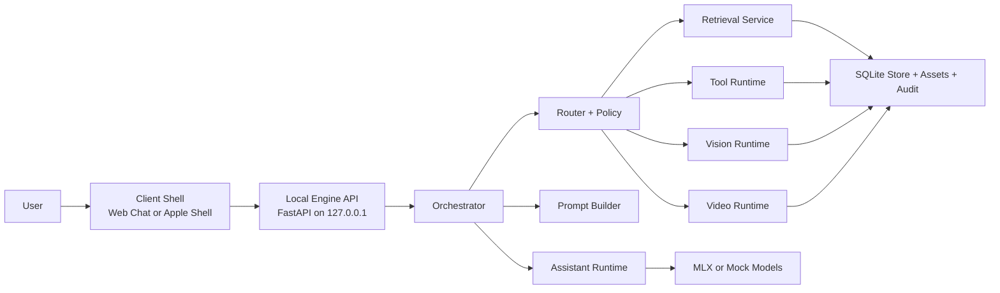
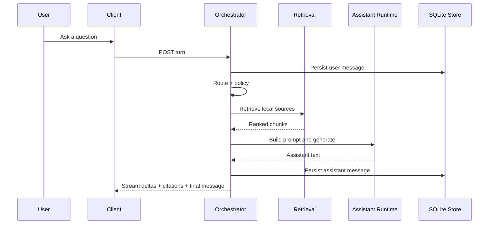
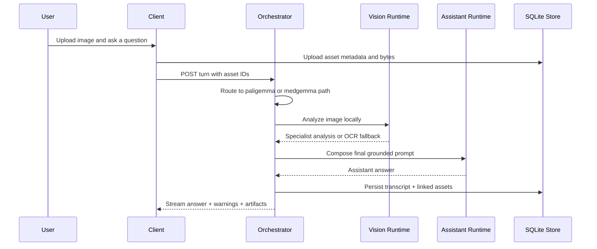
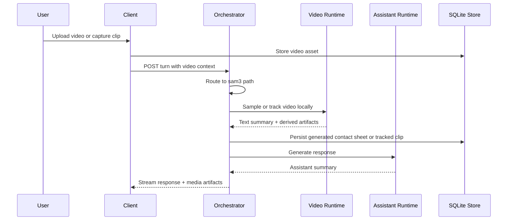
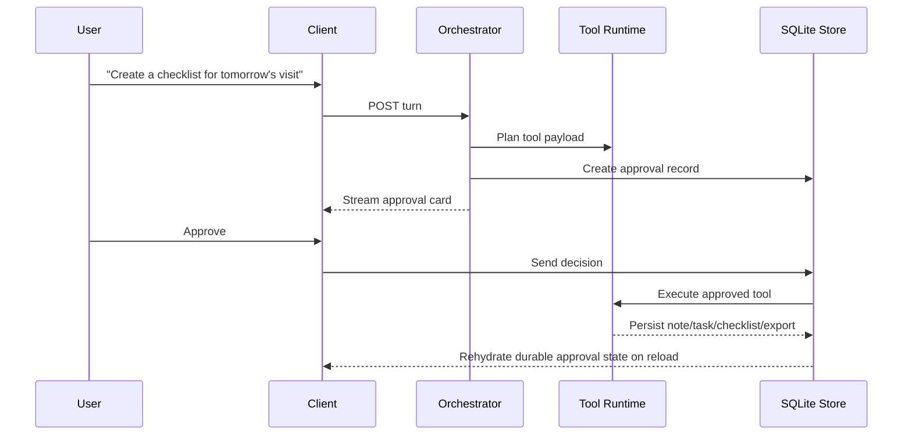

# Field Assistant Engine

Field Assistant Engine is an offline-first, local-first assistant stack for
serious real-world work: field operations, research, document intake,
translation, media review, and bounded task execution on local hardware.

The project is designed around a simple product truth:

- one assistant surface
- one local orchestrator
- specialist routes only when they add real value
- explicit approval for durable actions
- strong behavior when the network is missing or unreliable

This repository is intentionally opinionated. It is not a generic chatbot demo.
It is a practical architecture for building a robust local assistant that can be
used in rural settings, low-connectivity deployments, travel, research,
missionary and care workflows, and privacy-sensitive environments where sending
everything to the cloud is the wrong default.

## Why This Exists

Most AI demos assume:

- always-on internet
- unlimited cloud inference
- loose tool permissions
- weak memory boundaries
- no distinction between general help and higher-risk workflows

This project takes the opposite approach.

Field Assistant Engine is built to explore a better default:

- local inference where possible
- local retrieval and local persistence
- explicit routing between chat, retrieval, vision, video, and tools
- explicit medical-mode boundaries
- auditable approval workflows for writes and exports
- graceful degradation on smaller Apple Silicon laptops

The repo is also a reference implementation of a product thesis:

> one strong local agent core with specialist routes beats swarm-first design
> for v1 field use.

## Current Status

This is already runnable and testable.

Today the repository includes:

- a FastAPI local engine
- SQLite persistence with migrations
- chunked ingestion and hybrid retrieval
- local conversation history and transcript storage
- assistant generation via `mock` or `mlx`
- `EmbeddingGemma` integration path for local embeddings
- image specialist routing for OCR and MLX vision
- video specialist routing with FFmpeg fallback and optional SAM 3.1 path
- approval workflows for durable actions
- local tool execution for notes, tasks, checklists, reports, exports, and
  image overlays
- a browser chat shell
- native Apple shell scaffolding for macOS and iPhone/iPad experiments

What it is not yet:

- not a production-hardened release
- not a finished native desktop app
- not a clinically validated medical system
- not a full real-time camera monitoring stack yet
- not a general-purpose autonomous shell agent

## What Works Today

### Core assistant

- local conversations with persistent history
- streaming response events
- grounded answers with citations from local knowledge packs
- deterministic mock mode for reliable testing
- live MLX generation mode for real local model execution

### Retrieval and knowledge

- knowledge-pack import
- chunking during ingestion
- lexical plus embedding-based retrieval
- configurable retrieval weights and candidate limits
- seeded demo content so the system is testable immediately

### Media workflows

- image upload in chat
- OCR-first and MLX vision analysis
- medical image gating
- video upload in chat
- FFmpeg-based local sampling and contact-sheet generation
- optional SAM-style local tracking backend when a compatible model is present
- derived media artifacts returned back into the conversation

### Tools and approvals

- create and update notes
- create and update tasks
- create checklists
- draft reports and messages
- export briefs
- log observations
- generate image heatmap overlays
- durable approval cards for write actions

### Clients

- `apps/web-chat`: the most complete interactive shell today
- `apps/apple-shell`: SwiftUI macOS + iOS/iPadOS chat shell experiments
- `apps/desktop-macos`: reserved for the fuller native shell direction

## Product Principles

These principles drive the codebase and should continue to drive
contributions.

1. **Offline first**
   The system should still be useful with weak or no internet.

2. **One front door**
   Users should experience one assistant, not a pile of separate bots.

3. **Specialization underneath**
   Retrieval, translation, vision, video, and medical behavior can route
   differently under the hood without fragmenting the UX.

4. **Bounded agency**
   The assistant can prepare actions, but durable writes and gated workflows
   should remain explicit and inspectable.

5. **Graceful degradation**
   Smaller laptops should still run meaningful local workflows using lighter
   backends.

6. **Truthful UX**
   The system should say when it is using OCR, metadata fallback, heuristics, or
   a real specialist model.

7. **Separation of concerns**
   UI does not own persistence, routing, or model logic. The engine does.

## Architecture Overview

### High-level runtime



### Layered responsibility model

```text
+-------------------------------------------------------------------+
| Client Shells                                                     |
|-------------------------------------------------------------------|
| Web chat | Apple shell | future native desktop shell              |
|-------------------------------------------------------------------|
| Responsibilities: transcript UI, media pickers, camera UX,        |
| approvals, streaming display, session switching                   |
+-------------------------------------------------------------------+
                                |
                                v
+-------------------------------------------------------------------+
| Local Engine                                                      |
|-------------------------------------------------------------------|
| API -> Orchestrator -> Router/Policy -> Retrieval/Tools/Models    |
|-------------------------------------------------------------------|
| Responsibilities: all durable writes, all routing, all retrieval, |
| all model selection, all audit records, all approval state        |
+-------------------------------------------------------------------+
                                |
                                v
+-------------------------------------------------------------------+
| Local Resources                                                   |
|-------------------------------------------------------------------|
| SQLite | uploads | migrations | MLX models | FFmpeg | Tesseract   |
+-------------------------------------------------------------------+
```

### Execution path at a glance

```text
user turn
  -> conversation route
  -> policy evaluation
  -> optional retrieval
  -> optional image or video specialist
  -> optional tool proposal
  -> optional approval gate
  -> assistant draft generation
  -> transcript persistence
  -> audit trail
```

## User Flows

### 1. Standard grounded text turn



### 2. Image turn



### 3. Video turn



### 4. Approval-gated action



## Architectural Invariants

These are not style suggestions. They are repo contracts.

- UI must not write to SQLite directly.
- Only the engine owns routing, policy, retrieval, persistence, approvals, and
  model selection.
- Retrieval should return chunks with scores, not invisible internal magic.
- Medical behavior must remain an explicit workflow boundary, not a silent prompt
  toggle.
- Tool execution must stay typed and inspectable.
- Durable actions should create audit-relevant state.
- Fallbacks must be explicit in output and telemetry.

## Repository Layout

```text
apps/
  apple-shell/         SwiftUI macOS + iOS/iPadOS experimental shell
  desktop-macos/       Reserved directory for fuller native shell ownership
  web-chat/            Main interactive browser client today
contracts/
  events/              Event contract snapshots and stream shapes
  openapi/             Exported OpenAPI artifacts
data/
  migrations/          SQLite schema migrations
docs/                  Implementation-facing planning docs
engine/
  api/                 FastAPI app, dependency container, HTTP routes
  audit/               Audit logging service
  config/              Settings and environment loading
  contracts/           Pydantic API and stream contracts
  ingestion/           Document chunking and ingestion helpers
  models/              Assistant, vision, video, and model-source runtimes
  orchestrator/        Turn execution, prompt building, event streaming
  persistence/         SQLite store and migration application
  policy/              Gating and warning logic
  retrieval/           Embedding providers and retrieval service
  routing/             Route decision logic
  tools/               Registry and tool execution
evals/
  retrieval/           Retrieval cases and fixtures
  routing/             Routing cases and fixtures
scripts/               Smoke tests, eval runners, migration helpers, exporters
tests/                 Unit and integration-style tests
```

## Runtime Surface

### Engine

The local engine is started through:

```bash
uv run uvicorn engine.api.app:create_app --factory --reload
```

The FastAPI app mounts:

- `/` for a basic root response
- `/v1/system/health` for health
- `/v1/system/tools` for tool descriptors
- `/v1/conversations` for sessions and transcript flow
- `/v1/assets` for uploads and asset content
- `/v1/knowledge-packs` for imports
- `/v1/ingest` for ingestion
- `/v1/library` for search
- `/v1/notes` and `/v1/tasks` for durable outputs
- `/v1/translate` for translation
- `/v1/approvals` for decisions
- `/v1/medical` for medical sessions
- `/v1/exports` for export jobs
- `/chat/` for the bundled browser shell

### Client surfaces

#### `apps/web-chat`

This is the best current place to interact with the system end to end.

It supports:

- session switching
- transcript rendering
- streaming assistant output
- citations
- image upload
- video upload
- camera workspace and native capture fallback
- approval cards
- durable approval rehydration
- mobile-friendly layout

#### `apps/apple-shell`

This directory contains real SwiftUI shell code for:

- macOS
- iPhone
- iPad

It is not yet the primary tested client, but it is the right direction for the
fully native product.

#### `apps/desktop-macos`

This directory is reserved for the fuller native shell and engine lifecycle
ownership.

## Model and Backend Strategy

The system supports multiple backends because local hardware is variable and
because truthful fallback behavior matters.

| Surface | Primary direction | Current fallback / alternate |
| --- | --- | --- |
| Assistant text generation | `Gemma 4 E4B-it` via MLX | deterministic `mock`, lower-memory `Gemma 4 E2B-it 4bit` |
| Retrieval embeddings | `EmbeddingGemma` via MLX | local hash embedder |
| Image analysis | MLX vision runtime | `tesseract` OCR, metadata summary |
| Video review | SAM 3.1 local tracking | FFmpeg sampling + contact sheet, metadata summary |
| Medical image routing | `MedGemma` path | policy block or descriptive fallback |
| Translation | `TranslateGemma` route | generic assistant explanation until deeper integration |

This is deliberate. A local agent that only works on a maxed-out machine is not
actually field-ready.

## Tool Surface

Current tool registry:

- `create_note`
- `update_note`
- `create_task`
- `update_task`
- `create_checklist`
- `draft_report`
- `draft_message`
- `log_observation`
- `export_brief`
- `medical_case_summary`
- `generate_heatmap_overlay`

Not every tool is approval-gated, but durable writes are.

## Quickstart

### Prerequisites

Recommended environment:

- Apple Silicon Mac
- Python `3.12`
- [`uv`](https://docs.astral.sh/uv/)
- local tools as needed for richer media flows:
  - `tesseract`
  - `ffmpeg`
  - locally cached MLX-compatible model snapshots for live inference

### 1. Install dependencies

```bash
uv sync
```

### 2. Apply database migrations

```bash
uv run python scripts/migrate.py
```

### 3. Start the engine

```bash
uv run uvicorn engine.api.app:create_app --factory --reload
```

### 4. Open the interactive chat shell

Open [http://127.0.0.1:8000/chat/](http://127.0.0.1:8000/chat/).

### 5. Check the health endpoint

```bash
curl http://127.0.0.1:8000/v1/system/health
```

### 6. Run the test suite

```bash
uv run pytest
```

### 7. Run evals

```bash
uv run python scripts/run_local_eval.py routing
uv run python scripts/run_local_eval.py retrieval
```

### 8. Export the OpenAPI snapshot

```bash
uv run python scripts/export_openapi.py
```

## Run Profiles

### Safe low-memory development profile

Use this when you want an interactive local stack that is less likely to push a
smaller Mac into memory pressure:

```bash
bash scripts/run_low_memory_server.sh
```

That profile defaults to:

- `FIELD_ASSISTANT_ASSISTANT_BACKEND=mlx`
- `FIELD_ASSISTANT_ASSISTANT_MODEL_NAME=gemma-4-e2b-it-4bit`
- `FIELD_ASSISTANT_SPECIALIST_BACKEND=ocr`
- `FIELD_ASSISTANT_EMBEDDING_BACKEND=hash`

This is currently the recommended daily driver for UI and workflow testing.

### Full live MLX profile

Use this when you have local model weights available and want the richer path:

```bash
FIELD_ASSISTANT_ASSISTANT_BACKEND=mlx \
FIELD_ASSISTANT_EMBEDDING_BACKEND=mlx \
FIELD_ASSISTANT_SPECIALIST_BACKEND=auto \
uv run uvicorn engine.api.app:create_app --factory --reload
```

### Vision-focused live profile

```bash
FIELD_ASSISTANT_SPECIALIST_BACKEND=mlx \
FIELD_ASSISTANT_VISION_MODEL_SOURCE=mlx-community/paligemma2-3b-mix-224-4bit \
uv run uvicorn engine.api.app:create_app --factory --reload
```

### Video-focused local review profile

```bash
FIELD_ASSISTANT_TRACKING_BACKEND=ffmpeg \
uv run uvicorn engine.api.app:create_app --factory --reload
```

When a compatible local SAM model is available:

```bash
FIELD_ASSISTANT_TRACKING_BACKEND=auto \
uv run uvicorn engine.api.app:create_app --factory --reload
```

## Smoke Tests

These scripts are intended to make local verification fast.

### Basic chat

```bash
uv run python scripts/smoke_chat.py --backend mock
```

### Live retrieval

```bash
uv run python scripts/smoke_retrieval.py --backend mlx
```

### Image-backed turn

```bash
uv run python scripts/smoke_asset_turn.py --care-context general
```

### Approval flow

```bash
uv run python scripts/smoke_tool_approval.py
```

## Configuration

The engine reads settings from environment variables. The most important ones
are:

| Variable | Purpose | Default |
| --- | --- | --- |
| `FIELD_ASSISTANT_DB_PATH` | SQLite database path | `data/field-assistant.db` |
| `FIELD_ASSISTANT_ASSET_STORAGE_DIR` | Uploaded and derived asset root | `data/uploads` |
| `FIELD_ASSISTANT_ASSISTANT_BACKEND` | `mock` or `mlx` | `mock` |
| `FIELD_ASSISTANT_ASSISTANT_MODEL_NAME` | Assistant model id | `gemma-4-e4b-it` |
| `FIELD_ASSISTANT_ASSISTANT_MODEL_SOURCE` | Explicit assistant model path or repo | unset |
| `FIELD_ASSISTANT_EMBEDDING_BACKEND` | `hash` or `mlx` | `hash` |
| `FIELD_ASSISTANT_EMBEDDING_MODEL_NAME` | Embedding model id | `embeddinggemma-300m` |
| `FIELD_ASSISTANT_EMBEDDING_MODEL_SOURCE` | Explicit embedding model path or repo | unset |
| `FIELD_ASSISTANT_SPECIALIST_BACKEND` | `auto`, `mlx`, `ocr`, or `mock` | `auto` |
| `FIELD_ASSISTANT_VISION_MODEL_NAME` | Vision specialist model id | `paligemma-2` |
| `FIELD_ASSISTANT_VISION_MODEL_SOURCE` | Explicit vision model path or repo | unset |
| `FIELD_ASSISTANT_TRACKING_BACKEND` | `auto`, `mlx`, `ffmpeg`, or `mock` | `auto` |
| `FIELD_ASSISTANT_TRACKING_MODEL_NAME` | Tracking model id | `sam3.1` |
| `FIELD_ASSISTANT_TRACKING_MODEL_SOURCE` | Explicit tracking model path or repo | unset |
| `FIELD_ASSISTANT_MEDICAL_MODEL_NAME` | Medical specialist model id | `medgemma-1.5-4b` |
| `FIELD_ASSISTANT_ASSISTANT_MAX_TOKENS` | Assistant output budget | `220` |
| `FIELD_ASSISTANT_SPECIALIST_MAX_TOKENS` | Specialist output budget | `180` |
| `FIELD_ASSISTANT_TRACKING_RESOLUTION` | Working video resolution | `384` |
| `FIELD_ASSISTANT_TRACKING_DETECT_EVERY` | Video detection interval | `15` |
| `FIELD_ASSISTANT_VIDEO_SAMPLE_FRAMES` | Video sample count | `4` |
| `FIELD_ASSISTANT_ENABLE_MEDICAL_MODE` | Enable medical workflows | `true` |
| `FIELD_ASSISTANT_ENABLE_FUNCTION_GEMMA` | Reserved feature flag | `false` |

## Safety and Trust Boundaries

This repo should stay serious about boundaries.

### Approval boundaries

Tools that write durable state or enter higher-trust flows should require
confirmation.

### Medical boundaries

Medical behavior is an explicit route and workflow context. It must not silently
blend into general chat.

### Fallback honesty

If the system is using:

- OCR only
- metadata only
- FFmpeg sampling without semantic tracking
- heuristic overlay generation

it should say so.

### Local-first privacy

The intended default is local storage, local media handling, and local inference
when available.

## Performance and Practicality Notes

This repository has already been exercised on real Apple Silicon hardware, and
that exposed an important constraint:

- stacking large live chat models, vision models, and extra validation processes
  can destabilize smaller laptops

That is why the repo includes explicit lighter run modes instead of pretending
every development machine can handle the heaviest path all the time.

If you are contributing, treat memory pressure as a first-class engineering
constraint, not an afterthought.

## Current Limitations

The repo is already useful, but there are real gaps.

- The browser shell is ahead of the native shell.
- The native desktop ownership model is not finished.
- Real-time camera monitoring is still early.
- Video understanding is still stronger as evidence preparation than as a fully
  domain-tuned event engine.
- Medical flows are support-oriented and not clinically validated.
- Some specialist paths still degrade to OCR or metadata when local model assets
  are missing.
- Several model families are architecturally placed before they are fully
  benchmarked in-repo.

## Roadmap Direction

The broad build direction is:

1. strengthen local evals and regression coverage
2. keep improving the unified chat UX
3. deepen image, document, and video tooling
4. improve native Apple shells
5. add richer real-time monitoring flows
6. benchmark specialist backends instead of assuming them

## Related Documents

The repo includes additional architecture and research material:

- [docs/repo-plan.md](docs/repo-plan.md)
- [gemma-local-agent-architecture.md](gemma-local-agent-architecture.md)
- [offline-field-assistant-v1-product-spec.md](offline-field-assistant-v1-product-spec.md)
- [offline-field-assistant-v1-technical-architecture.md](offline-field-assistant-v1-technical-architecture.md)
- [gemma-local-expert-research-synthesis-2026-04-17.md](gemma-local-expert-research-synthesis-2026-04-17.md)

## Contributing

Contributions are welcome.

The most useful contributions are the ones that improve the project without
breaking its core constraints.

Good contribution areas:

- retrieval quality and evals
- local model adapters
- camera and video UX
- native Apple shell work
- accessibility and mobile responsiveness
- document ingestion
- safer tool workflows
- auditability and observability
- better tests and smoke coverage
- benchmark suites for local hardware tradeoffs

Before opening a pull request:

- read [CONTRIBUTING.md](CONTRIBUTING.md)
- preserve the offline-first, local-first architecture
- do not hide fallback behavior
- do not bypass approval or safety boundaries
- add or update tests when behavior changes
- update docs when the architecture or user flow changes

## Contribution Philosophy

This project is not trying to be everything.

Please do not optimize contributions for:

- maximum agent autonomy at any cost
- cloud-only assumptions
- abstract framework layering without real user value
- silently adding hidden unsafe powers
- turning the UI into a collection of separate “modes” that break the unified
  assistant experience

Please do optimize for:

- clarity
- local usability
- auditable behavior
- real field practicality
- graceful fallbacks
- measured improvements backed by tests or demos

## Open Source Goal

The goal is to make this repository useful as both:

- a working local assistant stack
- a serious reference architecture for offline-capable agent products

If you are building field research tools, missionary support tools, low-network
assistant systems, local care-support software, or privacy-sensitive AI clients,
this repo is meant to be a concrete starting point.
