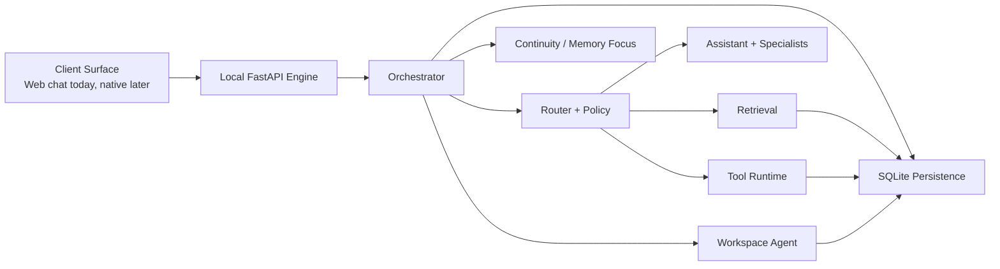
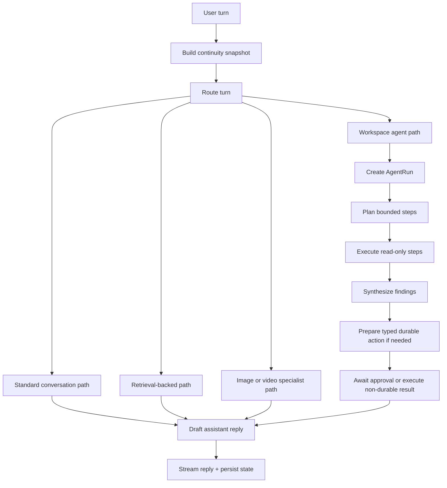
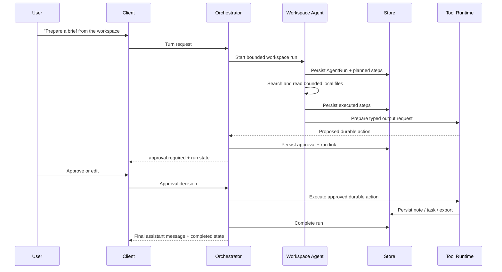
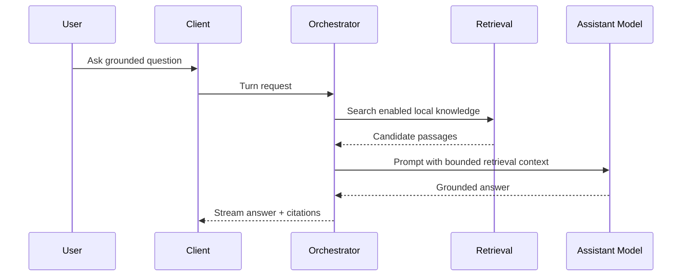
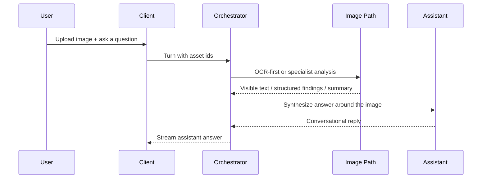

# Field Assistant Engine

Field Assistant Engine is a local-first, offline-first assistant stack for
serious work on local hardware.

It is designed for a different problem than a generic cloud chatbot demo.

It is trying to answer a harder product question:

> How do you build a trustworthy local assistant that can hold a real
> conversation, reason across local files, inspect images and video, prepare
> durable outputs, and use bounded agency without collapsing into either a toy
> chatbot or an unsafe autonomous shell?

The answer in this repo is:

- one assistant surface
- one local orchestrator
- specialist routes only when they add real value
- explicit approval for durable actions
- truthful fallback behavior when local capability is limited
- bounded workspace agency instead of arbitrary system control

If you want the shortest mental model, it is this:

> a conversation-first local workbench with bounded agency underneath

---

## Table of Contents

- [Why This Exists](#why-this-exists)
- [What This Repository Is](#what-this-repository-is)
- [What This Repository Is Not](#what-this-repository-is-not)
- [Current Status](#current-status)
- [Capability Snapshot](#capability-snapshot)
- [Product Principles](#product-principles)
- [Architecture Overview](#architecture-overview)
- [Agentic Architecture](#agentic-architecture)
- [Continuity, Memory, and Context Resolution](#continuity-memory-and-context-resolution)
- [Routing and Specialist Selection](#routing-and-specialist-selection)
- [Workspace Agent Runs](#workspace-agent-runs)
- [Tools, Approvals, and Durable Outputs](#tools-approvals-and-durable-outputs)
- [Streaming and Client Contract](#streaming-and-client-contract)
- [User Experience Model](#user-experience-model)
- [End-to-End User Flows](#end-to-end-user-flows)
- [Repository Layout](#repository-layout)
- [Persistence Model](#persistence-model)
- [API Surface](#api-surface)
- [Client Surfaces](#client-surfaces)
- [Model and Backend Strategy](#model-and-backend-strategy)
- [Quickstart](#quickstart)
- [Run Profiles](#run-profiles)
- [Testing and Evaluation](#testing-and-evaluation)
- [Configuration](#configuration)
- [Safety and Trust Boundaries](#safety-and-trust-boundaries)
- [Performance and Practicality Notes](#performance-and-practicality-notes)
- [Reliability Learnings](#reliability-learnings)
- [FAQ](#faq)
- [Current Limitations](#current-limitations)
- [Roadmap Direction](#roadmap-direction)
- [Related Documents](#related-documents)
- [Contributing](#contributing)
- [Contribution Philosophy](#contribution-philosophy)
- [Open Source Goal](#open-source-goal)

## Why This Exists

Most AI demos quietly assume all of the following:

- the network is always available
- cloud inference is the default answer to every hard problem
- chat, memory, tools, and writes can blur together
- fallback behavior can stay vague
- the UI can hide capability gaps behind optimistic language
- multi-turn continuity does not need to be robust

Those assumptions are wrong for many real environments.

Field Assistant Engine exists to explore a more serious pattern:

- useful with weak or missing internet
- useful on real Apple Silicon laptops, not only large servers
- able to converse normally, not only execute canned task demos
- able to inspect local media and local files
- able to prepare durable local outputs with explicit approval
- explicit about what it actually knows, what it inferred, and what it cannot do
- bounded enough to remain inspectable, testable, and safe

The motivating environments include:

- field and humanitarian operations
- privacy-sensitive research and document work
- low-connectivity travel workflows
- mixed text, image, and video conversations
- local-first synthesis and work-product generation
- agentic workflows that still need trust boundaries

## What This Repository Is

This repo is best understood as five things at once.

### 1. A local engine

The engine owns:

- routing
- orchestration
- retrieval
- ingestion
- persistence
- approvals
- durable writes
- model selection
- multimodal specialist routing
- bounded workspace-agent execution

It exposes those capabilities through a typed local API.

### 2. A browser-first demo client

The most complete interactive surface today is the web shell at `/chat/`.

That client is where current end-to-end work is best verified:

- streaming assistant turns
- media uploads
- approval editing
- run rehydration
- session deletion
- mobile and laptop QA

### 3. A bounded local agent harness

This repo does not just do single-turn chat.

It already supports:

- continuity across mixed turns
- referent recovery for drafts, notes, checklists, and earlier media
- bounded workspace search and synthesis
- approval-gated durable output creation
- live multimodal conversations that can return to normal chat after image or video turns

### 4. A reference architecture

The repo is also meant to document and prove out an architecture:

- one conversational front door
- one orchestrator
- explicit route selection
- typed tools
- explicit approval boundaries
- bounded state ownership

### 5. An open-source local-agent testbed

This codebase is also where the harness is being hardened:

- routing evals
- retrieval evals
- long mixed conversation evals
- live browser QA
- continuity regression tests
- multimodal stress paths

## What This Repository Is Not

It is important to be precise.

This repository is not:

- a production-hardened release
- a finished native desktop app
- a clinically validated medical system
- a broad desktop-wide autonomous shell agent
- a swarm of hidden subagents
- a "trust me" autonomous workflow runner

And it is not trying to fake those things with copy.

## Current Status

As of April 20, 2026, this repository is already runnable, testable, and
useful.

It is best described as:

- a serious demo-grade local assistant system
- a bounded agent harness
- a web-first multimodal workbench
- a growing evaluation and live-QA framework

### What works well today

- ordinary local chat
- follow-up continuity
- retrieval-backed answers from local sources
- image upload and conversational image follow-ups
- video upload and local review with derived artifacts
- workspace synthesis through a bounded agent run
- approval-gated local notes, tasks, checklists, observations, and markdown exports
- approval editing before save
- reload-safe transcript and approval state
- conversation deletion in the web shell

### What is solid but still improving

- long mixed multimodal conversations
- topic pivots after media turns
- workspace briefing quality across broad repos
- export copy quality in approvals
- local video review depth
- responsive UX polish on laptop and phone widths

### What is still early

- realtime camera monitoring
- strong native desktop parity
- robust local segmentation and tracking specialists
- clinically serious medical workflows
- general-purpose autonomous shell behavior

## Capability Snapshot

The table below describes the system as implemented, not as imagined.

| Area | Current behavior | Backing mechanism | Current maturity |
| --- | --- | --- | --- |
| Normal conversation | Casual, supportive, and teaching-style turns | assistant route + continuity snapshot | strong |
| Follow-up continuity | Handles "that draft", "that checklist", "what did you mean by that?" | explicit referent-resolution layer | strong |
| Retrieval-backed answers | Searches local knowledge packs and ingested documents | lexical + embedding scoring | strong |
| Image chat | Conversational image turns with OCR/specialist support | asset analysis + route selection | good |
| Video chat | Local sampling and review with artifact generation | ffmpeg-backed review path + tracking abstraction | usable |
| Workspace research | Bounded multi-step agent run inside workspace root | `AgentRun` + allowlisted workspace tools | good |
| Durable local writes | Notes, tasks, checklists, observations, markdown exports | typed tools + approval flow | good |
| Approval editing | User can edit pending drafts before execution | approval editor + allowlisted payload merge | good |
| Reload safety | Approvals and runs rehydrate after reload | persisted transcript, approvals, runs | strong |
| Capabilities truthfulness | UI can ask what is actually available | `/v1/system/capabilities` | strong |
| Realtime camera watch | Early UI surface, limited deep runtime | camera shell + live capture path | early |
| General shell autonomy | Not implemented by design | n/a | intentionally absent |

### Conversation and continuity

Implemented today:

- ordinary chat
- follow-up clarification
- supportive turns
- teaching-style turns
- retrieval-backed research turns
- mixed conversations that move between ordinary chat and higher-trust actions
- work-product follow-ups such as:
  - `what's in that draft again?`
  - `what is that checklist called?`
  - `make that shorter before I save it`

### Retrieval and local knowledge

Implemented today:

- knowledge pack import
- asset ingestion
- chunked indexing
- lexical plus embedding retrieval
- library search API
- retrieval grounding inside chat turns

### Multimodal behavior

Implemented today:

- image upload in chat
- OCR-first image understanding
- MLX vision path when available
- video upload in chat
- local frame sampling
- contact-sheet-style derived assets
- conversation continuity after media turns

### Bounded agentic behavior

Implemented today:

- workspace search
- bounded file reads inside configured workspace root
- persisted `AgentRun`
- step-level run tracking
- approval-gated durable outputs from workspace findings

### Durable local outputs

Implemented executors today:

- notes
- tasks
- checklists
- observations
- markdown exports
- derived image overlays

### Client features in the web shell

Implemented today:

- session rail
- session deletion
- streaming output
- image and video upload
- approval editing
- durable approval rehydration
- workspace-run display
- responsive laptop and phone behavior
- camera entry surface

## Product Principles

These are not marketing slogans. They are engineering constraints.

1. **Offline first**

   The system should remain useful when the network is weak or absent.

2. **Local first**

   Persistence, file access, media handling, and as much inference as possible
   should stay local.

3. **One front door**

   Users should experience one assistant, not a pile of separate bots.

4. **Specialization underneath**

   Specialists should exist behind routing, not as first-class user personas.

5. **Truth before theater**

   The system should tell the truth about which local capabilities are
   available.

6. **Bounded agency**

   The system may plan and synthesize within limits. It should not silently
   become an arbitrary system-control agent.

7. **Approval before durable writes**

   Any action that writes durable local state or enters a gated workflow should
   be explicit.

8. **Conversation remains primary**

   Media, tools, and runs are part of the conversation, not a parallel control
   plane that replaces it.

9. **Continuity matters**

   A strong assistant should understand what the user is re-mentioning,
   clarifying, or bringing up again.

10. **Evaluation is part of the product**

    A local agent harness without stress tests and live QA is not trustworthy.

## Architecture Overview

### High-level runtime



### Runtime cross-section

```text
┌─────────────────────────────────────────────────────────────────────┐
│ Client surfaces                                                    │
│  - web chat shell                                                  │
│  - apple shell (early)                                             │
│  - desktop macOS shell (early)                                     │
└──────────────────────────────┬──────────────────────────────────────┘
                               │ local HTTP / streaming
┌──────────────────────────────▼──────────────────────────────────────┐
│ Local engine                                                       │
│  - turn entrypoint                                                 │
│  - continuity snapshot                                             │
│  - bounded memory focus                                            │
│  - router + policy                                                 │
│  - retrieval                                                       │
│  - typed evidence packets                                          │
│  - assistant generation                                            │
│  - deterministic draft handoffs                                    │
│  - multimodal specialist paths                                     │
│  - workspace agent runs                                            │
│  - approvals + durable writes                                      │
└──────────────────────────────┬──────────────────────────────────────┘
                               │
┌──────────────────────────────▼──────────────────────────────────────┐
│ Local state                                                        │
│  - SQLite transcript and domain state                              │
│  - uploads under data/uploads                                      │
│  - exports under data/exports                                      │
│  - knowledge chunks + retrieval indexes                            │
└─────────────────────────────────────────────────────────────────────┘
```

### Responsibility model

| Layer | Owns | Does not own |
| --- | --- | --- |
| Client surface | display, input, upload flow, approval editing UX, responsive layout | routing, DB writes, retrieval policy |
| Orchestrator | turn lifecycle, continuity, memory focus, evidence-aware routing, tool/run coordination | direct UI logic |
| Router + policy | decide broad path, enforce boundaries | durable write execution |
| Tool runtime | typed plans, typed executors, pending-draft revision helpers | arbitrary shell commands |
| Workspace agent | bounded workspace research and synthesis | filesystem access outside workspace root |
| Persistence | transcript, approvals, runs, notes, reports, tasks, exports, assets, conversation memories | model selection |

### Execution path at a glance

```text
user turn
  -> transcript recovery
  -> continuity snapshot
  -> memory reranking + MemoryFocus
  -> route decision
  -> optional retrieval or specialist analysis
  -> typed evidence packet
  -> optional workspace run
  -> optional approval proposal
  -> deterministic handoff or assistant synthesis
  -> durable write only after approval
  -> transcript + state persistence
```

## Agentic Architecture

This repository is agentic, but in a bounded way.

### The actual control loop



### Why this is agentic without being swarm-first

The system already has real agentic behavior:

- it keeps explicit run state
- it plans bounded workspace steps
- it tracks step execution and approvals
- it can prepare durable actions from gathered evidence
- it can recover the current work product on follow-up turns

But it does **not** use swarm-style hidden autonomy as the main abstraction.

The current architecture prefers:

- one visible assistant
- one orchestrator
- specialist routes when justified
- deterministic shortcuts when truth should beat free-form generation
- typed tool interfaces
- explicit limits

That is a deliberate design stance.

### Design stance

The repo currently prefers:

- inspectable state over opaque "thinking"
- typed runs over free-form agent logs
- approval-gated writes over silent action
- bounded workspace exploration over arbitrary shell access

Subagents may be worth adding later in carefully scoped ways, but they are not
the current architecture.

## Continuity, Memory, and Context Resolution

Continuity is one of the most important parts of the system.

Many apparent "reasoning" failures in local assistants are really continuity and
answer-surface failures:

- stale image context leaking into a new topic
- the assistant forgetting which draft the user meant
- the wrong work product becoming the active referent
- the right answer being generated but shown in the wrong UI surface

This repository treats that problem as a first-class architecture concern.

### The continuity problem we are solving

A strong local assistant should be able to handle turns like:

- `what do you mean by that?`
- `go back to that image`
- `what's in that draft again?`
- `make that shorter before I save it`
- `what was in that checklist?`
- `actually just talk normally with me for a second`
- `now prepare a brief from the workspace`

Those are not edge cases. They are normal conversation.

### Current continuity layers

The current continuity model combines several layers:

1. **Recent transcript window**

   A bounded recent message history is always available to the orchestrator.

2. **Active topic recovery**

   The system tracks the active topic and a short list of recent earlier topics.

3. **Media continuity**

   The system tracks recent image and video assets and can reuse them only when
   the new turn clearly refers back to them.

4. **Grounded evidence continuity**

   Assistant messages can persist typed `EvidencePacket` state, and follow-up
   turns can reuse grounded facts and uncertainties instead of relying on
   assistant prose alone.

5. **Work-product continuity**

   The system tracks pending approval drafts and recent saved outputs as
   separate referents.

6. **Explicit referent selection**

   The system tries to decide what "that" most likely means before generation.

7. **Bounded memory focus**

   A small local `MemoryFocus` step reranks recent conversation memories and can
   recover older topic continuity without overriding stronger explicit referents.

8. **Workspace continuity**

   The system carries forward current run state and approval linkage for
   workspace-generated outputs.

### What the continuity snapshot currently carries

The continuity snapshot currently carries information such as:

- active topic
- recent earlier topics
- last user request
- last assistant reply
- recent image assets
- recent video assets
- selected context assets
- selected context kind and reason
- selected evidence summary
- selected evidence facts
- selected evidence uncertainties
- selected referent kind
- selected referent title
- selected referent summary
- selected referent preview
- recent conversation memories
- selected conversation memory topic
- selected conversation memory summary
- memory focus kind
- memory focus reason
- memory focus confidence
- pending approval id
- pending approval tool
- pending approval summary
- pending approval preview
- last completed output tool
- last completed output title
- last completed output preview
- last agent summary

### Continuity snapshot as an ASCII sketch

```text
ConversationContextSnapshot
├── active topic
├── recent earlier topics
├── recent conversation memories
├── recent image assets
├── recent video assets
├── selected context
│   ├── kind
│   ├── summary
│   └── assets
├── selected grounded evidence
│   ├── summary
│   ├── facts
│   └── uncertainties
├── memory focus
│   ├── kind
│   ├── topic frame
│   ├── confidence
│   └── reason
├── selected referent
│   ├── kind
│   ├── tool
│   ├── title
│   ├── summary
│   └── excerpt
├── pending approval
│   ├── id
│   ├── tool
│   ├── summary
│   └── excerpt
└── last completed output
    ├── tool
    ├── title
    └── excerpt
```

### What kinds of referents are recognized

The current system explicitly reasons about referent types such as:

- pending output
- saved output
- image
- video
- document
- missing output
- topic

It also recognizes many work-product phrases directly, including:

- `that draft`
- `that note`
- `that checklist`
- `that task`
- `that export`
- `before I save`
- `rename that`
- `what is the draft called`

### Why this matters

Without this layer, mixed multimodal conversations degrade quickly.

With it, the assistant can:

- stay on the current draft instead of drifting to the most recent image
- answer title questions about a checklist instead of a note export
- pivot back to normal conversation after a video turn
- re-reference an earlier image without needing the user to re-upload it

### A key implementation detail

This repo increasingly treats continuity failures as **foreground referent
selection failures**, not generic "memory" failures.

That distinction matters.

The right question is often not:

> How do we make the model remember more?

The right question is:

> What is the current object of work, and how do we make the system keep the
> right thing in the foreground?

### Current limitations in continuity

The continuity layer is much better than a naive transcript window, but it is
not magical.

Important current limits:

- common tighten / rename / title follow-ups on the active pending draft now
  mutate the pending payload heuristically, but broader free-form rewrite
  requests are still not guaranteed to rewrite the draft in place
- very broad workspace questions can still pull in overly broad repo context
- live multimodal continuity is much stronger, but long mixed conversations can
  still expose weaker ranking or answer-surface seams

## Routing and Specialist Selection

The router decides what kind of turn is happening before the assistant speaks.

### Current route decisions

The router currently distinguishes broad cases such as:

- ordinary conversation
- supportive conversation
- teaching-style answer
- retrieval-backed answer
- image turn
- video turn
- translation turn
- workspace-agent turn
- explicit durable-output intent
- medical-mode path

### Major interaction kinds

| Interaction kind | Typical user shape | Primary backing path |
| --- | --- | --- |
| Normal conversation | `hey`, `what do you think`, `talk normally with me` | assistant only |
| Retrieval-backed | `summarize the local guidance`, `what do the docs say` | retrieval + assistant |
| Teaching | `teach me how to...` | retrieval when useful + assistant |
| Image conversation | `what stands out in this image?` | image context + OCR/specialist + assistant |
| Video conversation | `review this short video` | video analysis + assistant |
| Workspace research | `prepare a brief from the workspace` | workspace agent run |
| Durable action | `create a checklist`, `save a note`, `export this` | typed tool proposal + approval if needed |

### Router truth table

| Signal | Effect |
| --- | --- |
| New attached media on this turn | Prefer current media route |
| Clear work-product reference | Prefer pending/saved output continuity |
| Clear topic pivot language | Break stale media continuity |
| Explicit workspace ask | Prefer workspace agent path |
| Explicit export/markdown ask | Bias toward export output instead of note output |
| Casual / supportive phrasing | Avoid over-triggering retrieval or tooling |

### Topic pivots matter

Users should not need a magic phrase like `separate topic`.

The current router is designed so that phrases such as:

- `actually just talk normally with me`
- `switch topics`
- `let's talk about something else`
- `prepare a briefing from the workspace`

override stale media context when appropriate.

That said, topic pivots are still an active hardening area, and mixed
multimodal threads remain one of the main evaluation targets in this repo.

### Model selection logic

The route does not choose one "best model" globally.

It chooses the least heavy path that can still do the job:

- normal text conversation can stay on the main assistant path
- image turns can stay OCR-first in low-memory mode
- video review can stay sampling-based without loading a heavier live tracker
- workspace runs can use local synthesis without pretending to be an arbitrary shell agent

### Why truthful routing matters

Good routing is not just about benchmark quality.

It is about:

- avoiding the wrong answer surface
- avoiding stale referent carryover
- avoiding unnecessary model loading
- avoiding false confidence when a specialist is not available

## Workspace Agent Runs

Workspace runs are the main bounded-agent feature in this repository.

### What it is

A workspace run is a persisted local research/synthesis run attached to a
conversation turn.

It is used for tasks like:

- search this workspace and summarize the relevant files
- prepare a brief from the workspace
- collect the main architecture points from these local docs
- create a note or export from the gathered findings

### What it can do

The workspace agent can currently:

- inspect the workspace root
- search text-like files
- read bounded excerpts from candidate files
- synthesize findings into bounded context
- prepare a typed durable output request from those findings

### What it cannot do

It cannot:

- execute arbitrary shell commands
- read outside the configured workspace root
- silently write durable local state without approval
- act as a broad desktop automation agent

### `AgentRun` model

Each run stores:

- `id`
- `conversation_id`
- `turn_id`
- `goal`
- `scope_root`
- `status`
- `plan_steps`
- `executed_steps`
- `result_summary`
- `artifact_ids`
- `approval_id`
- timestamps

### Run statuses

Implemented statuses:

- `running`
- `awaiting_approval`
- `completed`
- `blocked`
- `failed`

### Step statuses

Implemented statuses:

- `planned`
- `running`
- `completed`
- `awaiting_approval`
- `blocked`
- `failed`

### Current step types

Typical step types in current runs:

- inspect workspace scope
- search workspace files
- read candidate documents
- synthesize workspace findings
- prepare durable output

### Workspace run lifecycle



### Why this matters

This is the difference between:

- "the model talked about the workspace"

and:

- "the system performed a bounded, inspectable, persisted local run tied to the conversation"

## Tools, Approvals, and Durable Outputs

The tool surface is typed on purpose.

This repo does not rely on arbitrary free-form tool blobs for important local
writes.

### Current registry

| Tool | Purpose | Requires approval | Execution status |
| --- | --- | --- | --- |
| `create_note` | persist a note | yes | implemented |
| `create_report` | persist a report-shaped note record | yes | implemented |
| `create_message_draft` | persist a message draft record | yes | implemented |
| `update_note` | update a note | yes | registry only / early |
| `create_task` | persist a task | yes | implemented |
| `update_task` | update a task | yes | registry only / early |
| `create_checklist` | persist a checklist note | yes | implemented |
| `log_observation` | persist an observation note | yes | implemented |
| `export_brief` | write a markdown brief under `data/exports` | yes | implemented |
| `medical_case_summary` | medical-domain helper surface | yes | early / bounded |
| `workspace_search` | internal workspace-agent helper | n/a | implemented |
| `workspace_read_files` | internal workspace-agent helper | n/a | implemented |
| `workspace_summarize` | internal workspace-agent helper | n/a | implemented |
| `generate_heatmap_overlay` | derive annotated overlay asset | no | implemented |

### Common durable outputs in current practice

The most common current outputs are:

- note
- report
- message draft
- checklist
- task
- observation
- markdown export
- derived image artifact

### What `Save as a note` means

`Save as a note` means:

- the system has prepared a real persisted local `Note` entity
- the note will be written into the local application store after approval
- the note has a title, content, kind, and timestamp

It does **not** mean:

- a filesystem document by default
- a `.docx` file
- a rich exported report

### What `Export markdown` means

`Export markdown` means:

- the system has prepared a markdown document
- after approval it will be written as a real file under `data/exports/`
- the export result records the destination path and export status

This is different from a note.

### Notes versus exports

| Output type | Storage shape | Best for |
| --- | --- | --- |
| Note | persisted local record in the app store | in-app reference, logs, checklists, observations |
| Task | persisted local task record | actionable follow-up work |
| Checklist | note-kind record with checklist content | field prep, procurement, review lists |
| Markdown export | filesystem `.md` artifact under `data/exports/` | shareable brief or document-like output |

### Approval lifecycle

```text
tool proposal
  -> approval persisted
  -> user reviews summary or opens draft
  -> user may edit allowlisted fields
  -> user approves or rejects
  -> approved payload executes
  -> result is persisted and linked to transcript
```

### Approval editing

The current web shell supports editing pending payloads before execution.

Current edited fields include:

- note title
- note content
- checklist title
- checklist content
- task title
- task details
- task status
- export title
- export content

The current engine also supports a bounded conversational edit path for the
active pending draft. Common turns such as:

- `what is that report called?`
- `what's in that draft again?`
- `keep the same report, but make it shorter before I save it`
- `rename that checklist`

can now resolve the active draft and update or summarize it without forcing the
user back into the editor first.

### Important current limit

The UI editor is still the authoritative edit surface for arbitrary rewrites.

The assistant can discuss the draft conversationally, summarize it, and answer
questions about it, and common tighten/rename requests now mutate the pending
payload automatically. But wide-open rewrite requests are still not guaranteed
to rewrite the payload in place.

### Why typed tools matter

Typed tools make several things better:

- safer approvals
- clearer UI rendering
- better regression tests
- better persistence
- less accidental coupling between model prose and durable state

## Streaming and Client Contract

The browser shell depends on an explicit stream contract.

### Core event types

Current stream event types:

- `assistant.delta`
- `assistant.message.completed`
- `citation.added`
- `turn.status`
- `tool.proposed`
- `tool.started`
- `tool.completed`
- `approval.required`
- `warning`
- `error`

### Typical turn stream shape

```text
turn.status
  -> optional citation.added events
  -> optional tool.proposed
  -> optional approval.required
  -> assistant.delta chunks
  -> assistant.message.completed
```

### Workspace-run event enrichment

Workspace-related tool and approval events can carry:

- `run_id`
- step metadata
- progress state
- approval linkage

That lets the client render a quieter workbench surface without inventing state.

### UI contract philosophy

The client should not expose raw engine internals by default.

The current design direction is:

- concise human-facing summary in the main thread
- compact work-state facts near the answer
- deeper details behind opt-in disclosure
- short deterministic draft handoffs when the work product itself should carry
  the substance

That is especially important for:

- workspace runs
- approval surfaces
- multimodal analysis

## User Experience Model

The intended UX is not "a dashboard of agent internals."

It is a **conversational workbench**.

### Core UX rules

1. The conversation is the main object.
2. Status should be short and temporary.
3. Tools should feel subordinate to the task.
4. Approvals should feel like part of the response, not a separate product.
5. Media should remain conversational, not trap the user in a mode.
6. The composer should feel like the operational center of gravity.
7. Debug-style traces should not dominate the main thread.
8. Draft-producing turns should usually hand off quickly, then let the draft UI
   carry the details.

### Current web shell capabilities

The current browser shell includes:

- a left session rail
- per-conversation deletion
- a main conversation thread
- upload affordances for image and video
- compact assistant loading shells
- approval summaries with edit-before-save
- run-state surfaces
- laptop and phone responsive behavior
- camera / live capture entrypoints

### Design direction

The current UX direction is moving toward:

- quieter header framing
- denser session rail
- flatter inline work-state modules
- less "cards on cards on cards"
- a calmer assistant loading state

### Why this matters

A local agent can be technically strong and still feel weak if the UI exposes:

- too much raw process text
- duplicated status
- misleading or clipped work-product state
- tool chrome that competes with the conversation

## End-to-End User Flows

This section describes the main flows as currently implemented.

### 1. Standard grounded text turn



Typical user ask:

- `What do the local docs say about oral rehydration guidance?`

### 2. Ordinary conversational turn

```text
user asks a normal question
  -> continuity snapshot built
  -> router keeps the turn conversational
  -> assistant answers naturally
  -> no forced retrieval boilerplate
```

Typical user asks:

- `Hey, I'm a little scattered today. Help me think.`
- `What did you mean by that?`
- `Actually just talk normally with me for a second.`

### 3. Image turn



Important current principle:

An attached image should still be conversational.

The image is context, not a mode trap.

### 4. Video turn

```text
video upload
  -> metadata and local sampling
  -> optional local review pipeline
  -> derived artifact generation
  -> assistant synthesis in normal language
```

Important current principle:

After a video turn, the user should still be able to pivot back to normal
conversation without a magic reset phrase.

### 5. Work-product follow-up

```text
assistant has a pending or recent work product
  -> user says "what's in that draft again?"
  -> continuity layer selects the right referent
  -> assistant summarizes the current draft, not stale media
```

This flow is one of the most important continuity tests in the repo.

### 6. Workspace run + approval-gated output

```text
user asks for workspace synthesis
  -> workspace AgentRun begins
  -> search + bounded reads
  -> synthesis
  -> typed durable action prepared
  -> approval shown in thread
  -> user edits or approves
  -> durable output persisted locally
```

### 7. Mixed multimodal conversation

The current evaluation harness explicitly exercises transcripts that do things
like:

1. ordinary chat
2. follow-up clarification
3. teaching turn
4. image upload
5. image follow-up
6. supportive normal chat
7. video review
8. workspace export request
9. draft follow-up
10. topic reset back to ordinary conversation

That mixed-turn path is now part of the product contract, not just an ad hoc demo.

## Repository Layout

```text
apps/
  apple-shell/                Early Apple client shell
  desktop-macos/              Early native desktop shell
  web-chat/                   Primary browser demo client
contracts/
  openapi/                    Exported API contract snapshot
data/
  exports/                    Generated markdown exports
  migrations/                 SQLite schema migrations
  uploads/                    Uploaded and derived media assets
engine/
  agent/                      Workspace agent logic
  api/                        FastAPI app and route modules
  config/                     Settings and env loading
  context/                    Continuity and referent resolution
  contracts/                  Pydantic API/domain contracts
  ingestion/                  Asset and knowledge ingestion
  models/                     Assistant / specialist model adapters
  orchestrator/               Main turn execution path
  persistence/                SQLite-backed repositories
  policy/                     Guardrails and boundary rules
  retrieval/                  Search and ranking logic
  routing/                    Route selection
  tools/                      Tool registry and executors
evals/
  conversation/               Conversation eval cases
scripts/
  migrate.py                  Apply schema migrations
  export_openapi.py           Refresh OpenAPI snapshot
  run_local_eval.py           Routing / retrieval / conversation eval harness
  run_low_memory_server.sh    Safe low-memory daily driver
  smoke_*.py                  End-to-end smoke scripts
tests/
  test_*.py                   Unit and integration-style regression coverage
```

## Persistence Model

The repository uses local SQLite persistence with explicit domain objects.

### Primary persisted categories

- conversations
- transcript messages
- approvals
- notes
- tasks
- assets
- knowledge chunks
- agent runs
- exports

### Local filesystem state

In addition to SQLite records, the repo stores:

- uploaded media under `data/uploads/`
- derived media artifacts under `data/uploads/`
- markdown exports under `data/exports/`

### Why this split exists

Some outputs are best treated as structured in-app entities:

- notes
- tasks
- approvals
- runs

Some outputs are best treated as files:

- exported markdown briefs
- derived image assets

## API Surface

The current public local API is intentionally small but real.

### System

- `GET /`
- `GET /v1/system/health`
- `GET /v1/system/capabilities`
- `GET /v1/system/tools`

### Conversations

- `POST /v1/conversations`
- `GET /v1/conversations`
- `GET /v1/conversations/{conversation_id}/messages`
- `DELETE /v1/conversations/{conversation_id}`
- `POST /v1/conversations/{conversation_id}/turns`

### Runs

- `GET /v1/conversations/{conversation_id}/runs`
- `GET /v1/runs/{run_id}`

### Assets

- `POST /v1/assets/upload`
- `GET /v1/assets/{asset_id}`
- `GET /v1/assets/{asset_id}/content`

### Retrieval / library

- `POST /v1/knowledge-packs/import`
- `POST /v1/ingest/assets`
- `POST /v1/library/search`

### Durable outputs

- `GET /v1/notes`
- `GET /v1/tasks`
- `POST /v1/exports`

### Control surfaces

- `POST /v1/approvals/{approval_id}/decisions`
- `POST /v1/medical/sessions`
- `POST /v1/translate`

### Browser shell

- `GET /chat/`

### Capabilities truthfulness

`GET /v1/system/capabilities` is especially important.

It reports things like:

- assistant backend and model
- embedding backend and model
- specialist backend and vision model
- tracking backend and tracking model
- medical model
- workspace root
- whether `tesseract` is available
- whether `ffmpeg` is available
- whether the expected models are actually available
- whether low-memory profile is active

That endpoint exists so the UI can be honest about what the system can really do.

## Client Surfaces

### `apps/web-chat`

This is the primary tested client surface today.

It is where the current product contract is strongest:

- session list
- streaming answers
- uploads
- approvals
- run displays
- pending draft editing
- conversation deletion
- responsive desktop and phone behavior

If you are validating end-to-end behavior, start here.

### `apps/apple-shell`

This is an early Apple client surface.

It exists, but it is not the reference surface for:

- approval UX
- workspace run UX
- current mixed multimodal QA

### `apps/desktop-macos`

This is also early.

The long-term direction still includes a stronger native desktop client, but the
web shell is the reference client today.

## Model and Backend Strategy

The runtime is designed to degrade gracefully.

### Current assistant modes

- `mock`
- `mlx`

Default model names in settings:

- assistant: `gemma-4-e4b-it`
- embeddings: `embeddinggemma-300m`
- translation: `translategemma-4b`
- vision: `paligemma-2`
- tracking: `sam3.1`
- medical: `medgemma-1.5-4b`
- function-calling candidate: `functiongemma-270m-it`

### Current image specialist modes

- `ocr`
- `mlx`
- `auto`

### Current video specialist modes

- sampling + ffmpeg-backed local review
- tracking backend abstraction with `auto` and `ffmpeg`

### Capability truthfulness

The system does not assume that naming a backend means it is usable.

The capabilities endpoint distinguishes:

- configured backend
- configured model name
- actual local availability

That is a critical part of keeping the UI honest.

### Safe default posture

For daily development on smaller Apple Silicon hardware, the system prefers:

- smaller assistant profile
- OCR-first image path
- hash embeddings when appropriate
- lower memory pressure

That tradeoff is deliberate.

## Quickstart

### Prerequisites

Recommended local environment:

- Apple Silicon Mac
- Python `3.12`
- [`uv`](https://docs.astral.sh/uv/)
- optional local helpers for richer media workflows:
  - `tesseract`
  - `ffmpeg`
  - locally cached MLX-compatible model snapshots

### 1. Install dependencies

```bash
uv sync
```

### 2. Apply database migrations

```bash
uv run python scripts/migrate.py
```

### 3. Start the engine

```bash
uv run uvicorn engine.api.app:create_app --factory --reload
```

### 4. Open the chat shell

Open [http://127.0.0.1:8000/chat/](http://127.0.0.1:8000/chat/).

### 5. Check health and capabilities

```bash
curl http://127.0.0.1:8000/v1/system/health
curl http://127.0.0.1:8000/v1/system/capabilities
```

### 6. Run tests

```bash
uv run pytest
```

### 7. Run eval suites

```bash
uv run python scripts/run_local_eval.py routing
uv run python scripts/run_local_eval.py retrieval
uv run python scripts/run_local_eval.py conversation
```

### 8. Run smoke tests

```bash
uv run python scripts/smoke_chat.py --backend mock
uv run python scripts/smoke_retrieval.py --backend mlx
uv run python scripts/smoke_asset_turn.py --care-context general
uv run python scripts/smoke_tool_approval.py
uv run python scripts/smoke_workspace_agent.py --mode summarize
uv run python scripts/smoke_workspace_agent.py --mode brief
uv run python scripts/smoke_deep_conversation.py
```

### 9. Export OpenAPI

```bash
uv run python scripts/export_openapi.py
```

## Run Profiles

### Safe low-memory development profile

Use this when you want the most reliable daily driver on a smaller Mac:

```bash
bash scripts/run_low_memory_server.sh
```

That profile defaults to:

- `FIELD_ASSISTANT_ASSISTANT_BACKEND=mlx`
- `FIELD_ASSISTANT_ASSISTANT_MODEL_NAME=gemma-4-e2b-it-4bit`
- `FIELD_ASSISTANT_SPECIALIST_BACKEND=ocr`
- `FIELD_ASSISTANT_EMBEDDING_BACKEND=hash`

Recommended for:

- UI development
- browser QA
- repeated smoke tests
- avoiding memory pressure crashes

### Full live MLX profile

Use this when you have the local model assets and want the richer path:

```bash
uv run python scripts/check_full_local_tracking.py
bash scripts/run_full_local_server.sh
```

`check_full_local_tracking.py` tells you whether the current environment can actually run
local SAM tracking/isolation or whether the server will still fall back to sampled-frame
review. It checks:

- whether `ffmpeg`/`ffprobe` are available for fallback review
- whether the `mlx_vlm` SAM runtime is importable
- whether a local `sam3.1` snapshot is actually cached or pointed to by
  `FIELD_ASSISTANT_TRACKING_MODEL_SOURCE`

If the checker says the stack is not ready, the app should be treated as fallback-only for
video work even if the tracking backend is set to `auto` or `mlx`.

### Vision-focused live profile

```bash
FIELD_ASSISTANT_SPECIALIST_BACKEND=mlx \
FIELD_ASSISTANT_VISION_MODEL_SOURCE=mlx-community/paligemma2-3b-mix-224-4bit \
uv run uvicorn engine.api.app:create_app --factory --reload
```

### Video-focused local review profile

```bash
FIELD_ASSISTANT_TRACKING_BACKEND=ffmpeg \
uv run uvicorn engine.api.app:create_app --factory --reload
```

When a compatible local tracking model is available:

```bash
FIELD_ASSISTANT_TRACKING_BACKEND=auto \
uv run uvicorn engine.api.app:create_app --factory --reload
```

## Testing and Evaluation

Testing in this repo is intentionally layered.

### 1. Unit and integration-style tests

The test suite covers areas such as:

- routing
- prompting
- continuity and referent selection
- orchestrator behavior
- tool planning and execution
- persistence
- app route behavior
- agent runs

These are the main regression guardrails for the harness.

### 2. Eval suites

`scripts/run_local_eval.py` currently supports:

- `routing`
- `retrieval`
- `conversation`

The conversation evals are important because they already exercise mixed-turn
behavior rather than only isolated single-turn prompts.

### 3. Smoke tests

The smoke scripts cover operational slices such as:

- chat
- retrieval
- media asset turns
- tool approval path
- workspace summarize
- workspace brief
- deeper mixed conversation smoke

### 4. Live browser QA

The repo also uses real browser QA against the live shell.

That has repeatedly found issues the unit tests did not catch, including:

- stale status chrome
- clipped or confusing approval surfaces
- scroll-position bugs when expanding long context
- stale media carryover in mixed-turn live threads
- noisy run cards exposing raw agent internals

### 5. What we stress test now

Current higher-value stress paths include:

- image upload plus follow-up in the same thread
- video review plus topic pivot back to normal conversation
- longer mixed conversation with approval edit before save
- workspace export request after unrelated earlier media
- work-product follow-ups like `what was in that draft again?`

### 6. Deep mixed conversation smoke

The deeper smoke harness is intentionally messy.

It exercises a conversation that mixes:

- ordinary chat
- clarification
- teaching
- image turn
- image follow-up
- supportive normal chat
- video turn
- workspace export flow
- draft follow-up
- topic reset
- approval execution and run inspection

That is the right shape of test for this repo.

### 7. Why this matters

A local agent harness does not become reliable by passing isolated unit tests
alone.

It becomes reliable by proving that:

- mixed context does not drift easily
- the right work product stays in the foreground
- the UI and engine agree on what is happening
- durable actions remain gated and inspectable

## Configuration

The system is heavily environment-driven.

### Core paths

Important defaults:

- database: `data/field-assistant.db`
- uploads: `data/uploads`
- exports: `data/exports`
- workspace root: current working directory unless overridden

### Assistant generation

Important fields:

- `FIELD_ASSISTANT_ASSISTANT_BACKEND`
- `FIELD_ASSISTANT_ASSISTANT_MODEL_NAME`
- `FIELD_ASSISTANT_ASSISTANT_MODEL_SOURCE`
- `FIELD_ASSISTANT_ASSISTANT_MAX_TOKENS`
- `FIELD_ASSISTANT_ASSISTANT_TEMPERATURE`
- `FIELD_ASSISTANT_ASSISTANT_TOP_P`

### Retrieval and embeddings

Important fields:

- `FIELD_ASSISTANT_EMBEDDING_BACKEND`
- `FIELD_ASSISTANT_EMBEDDING_MODEL_NAME`
- `FIELD_ASSISTANT_EMBEDDING_MODEL_SOURCE`
- `FIELD_ASSISTANT_RETRIEVAL_LEXICAL_WEIGHT`
- `FIELD_ASSISTANT_RETRIEVAL_SEMANTIC_WEIGHT`
- `FIELD_ASSISTANT_RETRIEVAL_CANDIDATE_LIMIT`

### Specialist image and video routes

Important fields:

- `FIELD_ASSISTANT_SPECIALIST_BACKEND`
- `FIELD_ASSISTANT_VISION_MODEL_NAME`
- `FIELD_ASSISTANT_VISION_MODEL_SOURCE`
- `FIELD_ASSISTANT_TRACKING_BACKEND`
- `FIELD_ASSISTANT_TRACKING_MODEL_NAME`
- `FIELD_ASSISTANT_TRACKING_MODEL_SOURCE`
- `FIELD_ASSISTANT_TRACKING_RESOLUTION`
- `FIELD_ASSISTANT_TRACKING_DETECT_EVERY`
- `FIELD_ASSISTANT_VIDEO_SAMPLE_FRAMES`

### Medical and function flags

Important fields:

- `FIELD_ASSISTANT_ENABLE_FUNCTION_GEMMA`
- `FIELD_ASSISTANT_ENABLE_MEDICAL_MODE`
- `FIELD_ASSISTANT_MEDICAL_MODEL_NAME`
- `FIELD_ASSISTANT_MEDICAL_MODEL_SOURCE`

### Conversation and agent bounds

Important fields:

- `FIELD_ASSISTANT_CONVERSATION_HISTORY_LIMIT`
- `FIELD_ASSISTANT_CONTINUITY_HISTORY_LIMIT`
- `FIELD_ASSISTANT_AGENT_MAX_STEPS`
- `FIELD_ASSISTANT_AGENT_MAX_FILE_READS`
- `FIELD_ASSISTANT_AGENT_MAX_CONTEXT_CHARS`

## Safety and Trust Boundaries

Safety in this repo is primarily about trust boundaries and honesty.

### Approval boundaries

Durable writes should not silently happen just because the model mentioned them.

The current design requires approval for important actions such as:

- note creation
- task creation
- checklist creation
- observation logging
- markdown export
- derived overlay generation

### Workspace boundaries

The workspace agent is intentionally limited to the configured workspace root.

That means:

- no arbitrary filesystem escape
- no arbitrary shell execution
- bounded local file reads only

### Medical boundaries

Medical capability is explicitly bounded.

This repo is not claiming clinical readiness.

Medical mode exists as an explicit bounded path, not as ambient default chat.

### Fallback honesty

The system should not pretend that a local specialist exists if it does not.

That is why the capabilities endpoint reports:

- configured backends
- model availability
- tool availability like `tesseract` and `ffmpeg`
- low-memory mode status

### Local-first privacy

The repo is explicitly oriented toward local processing and local storage.

That does not make it automatically safe, but it does mean the architecture is
trying to keep:

- uploads local
- outputs local
- state local
- evaluation local

## Performance and Practicality Notes

This project is being built for real local hardware, not idealized benchmark
machines.

Important current lessons:

- low-memory profiles matter more than maximal model ambition
- OCR-first image understanding is often a better daily-driver tradeoff than
  heavier multimodal stacks
- routing discipline matters because loading every specialist all the time is
  the fastest path to memory pressure
- bounded context is not just a prompt concern; it is also a performance concern
- the UI should not assume a richer backend than the current machine actually has

The repo intentionally values:

- graceful degradation
- truthful capability display
- usable low-memory daily driving

over:

- permanently loading every possible specialist
- pretending that every machine is an M-class max workstation

## Reliability Learnings

This repo has already learned several things the hard way.

### 1. Many "reasoning" failures are really interface failures

Examples:

- wrong tool surface for the task
- wrong active referent
- stale media carryover
- the right information shown in the wrong UI block
- generated outputs polluting later workspace retrieval

### 2. Mixed-turn multimodal conversations are the real benchmark

Single-turn image or single-turn retrieval demos are too easy.

The stronger benchmark is:

- image
- follow-up
- ordinary conversation
- video
- workspace ask
- approval-backed output
- later draft reference

in one thread.

### 3. Continuity should be treated as state selection, not vague memory

The system gets better when it asks:

- what is the current object of work?
- what does "that" refer to right now?
- what earlier asset or output is actually relevant?

instead of merely stuffing more transcript into the prompt.

### 4. UI bugs can look like reasoning bugs

The repo has already hit cases where:

- scroll snapping made expanded content appear missing
- stale status chrome made finished turns look unfinished
- overly nested cards made the system feel more confused than it really was

That is why live browser QA matters.

## FAQ

### Is this only for tasks, or can it hold a normal conversation too?

It is explicitly designed to do both.

This is not meant to be a task-only harness.

The current system supports:

- normal conversation
- supportive conversation
- teaching
- grounded research
- multimodal discussion
- approval-gated work products

### Does an attached image still stay conversational?

Yes.

That is an explicit product goal.

An image should remain part of the conversation, even if specialist analysis is
used underneath.

The user should be able to ask things like:

- `what stands out here?`
- `does anything look off?`
- `talk me through this`
- `what matters most in this image?`

without being forced into tool language.

### Do I need to say `separate topic` every time?

No.

The router is increasingly designed so that clear topic pivots break stale media
context without a magic phrase.

That said, topic pivots remain an active hardening area, especially in long
multimodal threads.

### What does `save as a note` mean?

It means the system has prepared a real persisted local `Note` entity.

That note is stored in the local app state after approval.

It is not the same thing as a standalone exported document file.

### What kinds of things can the system create right now?

Currently implemented durable output surface:

- notes
- checklists
- tasks
- observations
- markdown exports
- derived image overlay assets

The system can also produce non-durable draft helper outputs internally.

### Is `save as a note` the same as a document export?

No.

- notes are persisted local entities in the app store
- markdown exports are real files written under `data/exports/`

### Is this a general-purpose autonomous shell agent?

No.

The current workspace agent is intentionally bounded:

- workspace-root only
- allowlisted research and synthesis operations
- no arbitrary shell execution
- approval before durable writes

### Is the browser shell the primary client?

Yes, today.

The web shell is the primary reference client for:

- approvals
- workspace run UX
- multimodal QA
- responsive browser testing

## Current Limitations

This project is already useful, but several important gaps remain.

- not a production-hardened release
- not a finished native desktop experience
- not a clinically validated medical system
- no broad autonomous shell execution
- no fully mature realtime camera monitoring stack
- bounded conversational draft edits now handle common same-report / same-checklist / same-note follow-ups, but broad free-form rewrites still fall back to the editor or a clarification turn
- workspace synthesis on very broad repos still needs another ranking pass
- video review is usable but still shallower than the long-term ambition
- stronger local segmentation and tracking paths are still in progress

## Roadmap Direction

The current direction is clear.

### Near-term priorities

- stronger long-horizon continuity in mixed multimodal conversations
- broader durable output types
- more reliable workspace synthesis ranking
- better multimodal assistant phrasing without mechanical wrapper text
- richer live browser QA scenarios
- stronger export and report surfaces

### Medium-term priorities

- stronger local segmentation and tracking specialists
- better camera/live-monitoring stack
- more native client parity
- tighter approval + conversational edit cohesion
- more robust field and document workflows

### Longer-term priorities

- deeper local specialist coverage
- stronger model-routing policy
- more refined memory/context selection
- stronger release hardening and packaging

## Related Documents

Key docs in this repo:

- [offline-field-assistant-v1-product-spec.md](/Users/cheickdiakite/Codex/gemma-local-expert/offline-field-assistant-v1-product-spec.md)
- [offline-field-assistant-v1-technical-architecture.md](/Users/cheickdiakite/Codex/gemma-local-expert/offline-field-assistant-v1-technical-architecture.md)
- [gemma-local-agent-architecture.md](/Users/cheickdiakite/Codex/gemma-local-expert/gemma-local-agent-architecture.md)
- [CONTRIBUTING.md](/Users/cheickdiakite/Codex/gemma-local-expert/CONTRIBUTING.md)
- [contracts/openapi/field-assistant.openapi.json](/Users/cheickdiakite/Codex/gemma-local-expert/contracts/openapi/field-assistant.openapi.json)

Use this README as the current top-level map of what is implemented **today**.

Use the architecture docs for deeper design history and longer-term shape.

## Contributing

Contributions are welcome, but this repository benefits most from
contributions that respect the product contract instead of adding random local
AI features.

### Especially valuable contribution areas

- continuity and referent-resolution robustness
- mixed multimodal conversation testing
- workspace-agent ranking and synthesis quality
- stronger export and report surfaces
- truthful capability display
- live browser QA and responsive UX hardening
- local video and tracking improvements
- evaluation harness expansion

### Before opening a pull request

Please do the following:

1. Read this README and [CONTRIBUTING.md](/Users/cheickdiakite/Codex/gemma-local-expert/CONTRIBUTING.md).
2. Verify the change against the current product boundaries.
3. Run the smallest relevant test surface, not just a source edit.
4. Prefer real regression tests over "should be fine" reasoning.
5. Do not quietly expand the safety surface without documenting it.

### Good contribution style in this repo

Good changes in this repo usually have these qualities:

- they are explicit about what is implemented versus aspirational
- they improve continuity, routing, trust, or UX discipline
- they keep conversation as the primary surface
- they do not smuggle in arbitrary autonomy
- they improve evaluation and live verification alongside behavior

## Contribution Philosophy

This repository is trying to be unusually disciplined about a few things.

### 1. Product honesty

Do not describe an early prototype as if it is a finished production system.

### 2. Trust boundaries

Do not widen local write power or autonomy casually.

### 3. Conversation quality matters

Do not treat the assistant as only a tool launcher.

### 4. Evaluation is part of the work

A feature is stronger when it comes with:

- tests
- eval coverage
- smoke coverage
- live QA notes when relevant

### 5. Low-memory viability matters

Contributions should respect the fact that the daily-driver path is not "load
every large model at once."

## Open Source Goal

The open-source goal of this repository is not merely to ship another chat demo.

It is to become a strong reference implementation for a local-first assistant
that is:

- conversation-first
- multimodal
- boundedly agentic
- approval-aware
- truthful about capability
- evaluated against real mixed-turn failure modes

If this project succeeds, it should help answer a broader question for open
local AI systems:

> What does a serious local assistant architecture actually look like when you
> care about continuity, trust, multimodal work, and real user experience at
> the same time?
