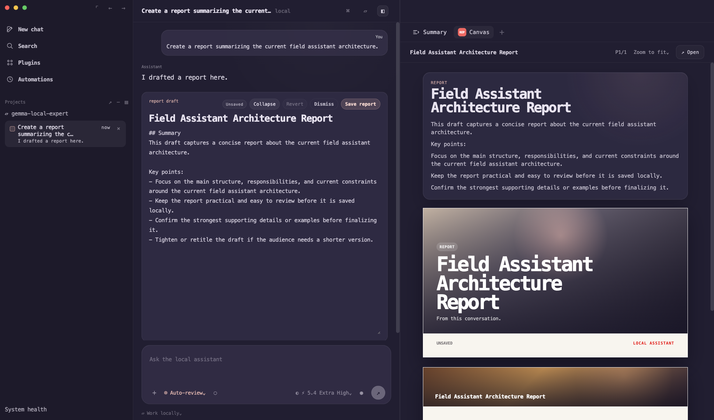
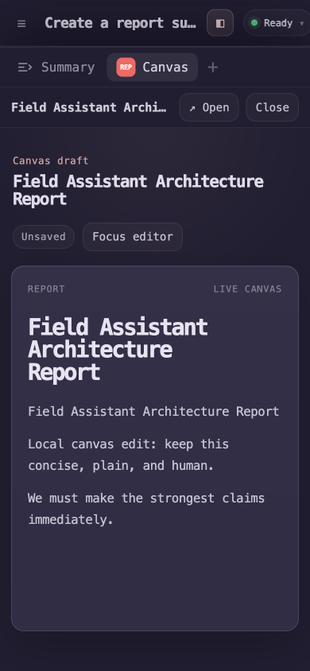
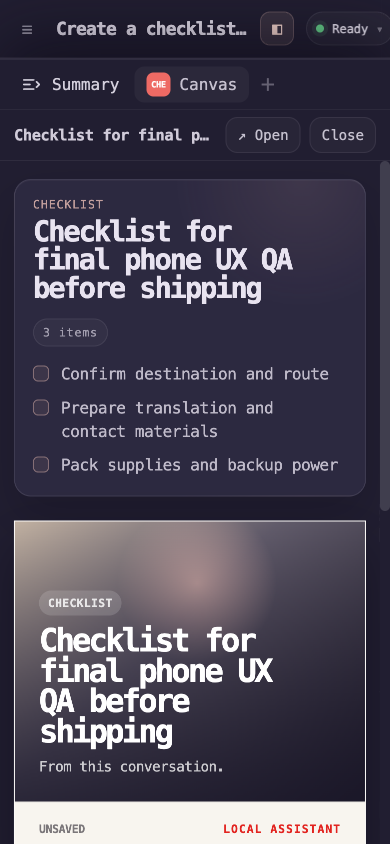
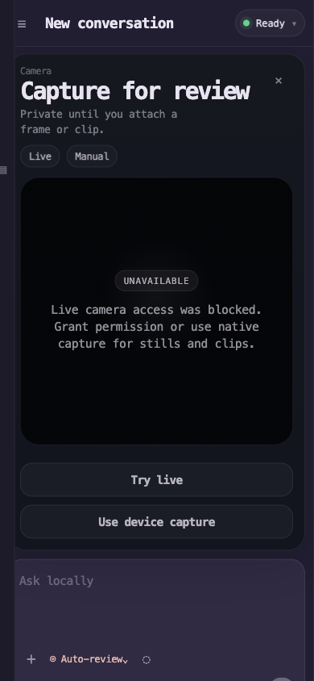

# web-chat

`apps/web-chat` is the most complete interactive client in the repository today.

It is a bundled browser shell for the local engine and is intended to validate:

- unified chat UX
- transcript rendering
- session switching
- streaming assistant output
- citations
- approval workflows
- media upload flows
- camera and video interactions
- mobile-sized layouts

## Run

Start the engine:

```bash
uv run uvicorn engine.api.app:create_app --factory --reload
```

Then open:

```text
http://127.0.0.1:8000/chat/
```

## Product screenshots

These screenshots are copied from the live browser QA flow and show the current
shape of the product surface.

<p>
  
</p>

<p>
  
  
  
</p>

## Current capabilities

- conversation list and switching
- transcript loading and replay
- streaming assistant deltas and final messages
- status and process indicators
- citation chips
- durable approval cards with rehydration after reload
- image upload and preview
- video upload and preview
- camera workspace with native capture fallback
- mobile-friendly composer

## Position in the repo

This shell is ahead of the native clients for day-to-day interactive testing.
It is the fastest way to validate:

- retrieval behavior
- approval UX
- image workflows
- video workflows
- low-memory local runs
