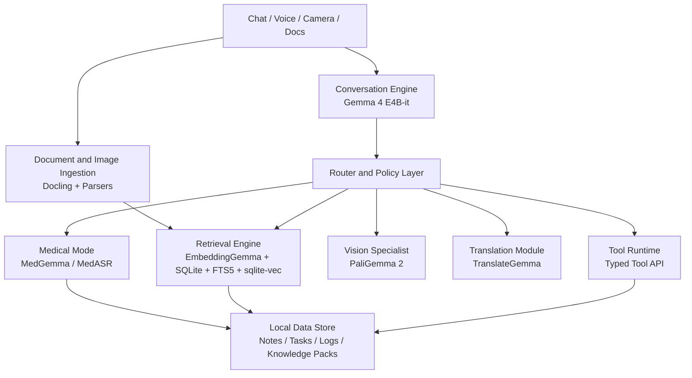

# Offline Field Assistant v1 Product Spec

Date: April 17, 2026
Status: Draft
Working title: Field Assistant

Related brief:
- [Gemma Local Agent Architecture Brief](gemma-local-agent-architecture.md)
- [Gemma Local Expert Research Synthesis](gemma-local-expert-research-synthesis-2026-04-17.md)

## Product definition

Field Assistant is an offline-first local AI assistant for research, field operations, writing, translation, document intake, and bounded task execution on Apple Silicon using MLX.

It is designed for:

- low-connectivity and no-connectivity environments
- missionary and nonprofit field trips
- researchers and program staff working from local knowledge packs
- care teams who need note-taking, translation, document understanding, and tightly gated medical support

Field Assistant is not a generic chatbot. It is a local operating layer for practical work.

## Product thesis

The right v1 is not "many agents doing everything."

The right v1 is:

- one strong local assistant
- retrieval first
- specialist model routing only when needed
- explicit tools
- explicit approvals
- strong offline behavior

## V1 outcome

By the end of v1, a user should be able to:

- import local knowledge packs and search them conversationally
- chat naturally by text or voice
- draft notes, reports, messages, and checklists offline
- translate text and text-in-images across supported languages
- ingest photos and documents and extract useful structured information
- create and manage simple local tasks
- enter medical mode for bounded assistive workflows if the medical module is enabled

## Product shape

V1 ships as one desktop product with modular capabilities.

Core product:

- general assistant
- retrieval and memory
- document and image intake
- task and note tools
- translation
- voice

Specialist modules:

- medical mode
- advanced visual extraction
- sync pack

## Target users

### 1. Field researcher

Needs:

- summarize local documents
- search notes and references
- draft field reports
- organize findings offline

### 2. Mission trip coordinator

Needs:

- prepare checklists
- translate messages
- keep trip notes
- generate daily summaries
- search training or care materials without internet

### 3. Community care worker

Needs:

- intake notes
- form and document understanding
- educational material translation
- tightly bounded medical support workflows

### 4. Executive or operations lead

Needs:

- concise briefings
- decision support
- local artifact generation
- search across mission, research, and operations notes

## Primary use cases

### A. Offline research assistant

User asks a question against local PDFs, notes, manuals, and prior reports. Assistant retrieves relevant passages, cites local sources, and drafts a usable answer.

### B. Field note and report generation

User drops in notes, images, and documents from the day. Assistant creates a clean daily summary, incident log, research memo, or follow-up message.

### C. Translation and cross-language support

User translates typed text, photographed signs, posters, forms, or instructions using local translation models.

### D. Visual document intake

User photographs a form, poster, medicine label, lab sheet, or handwritten note. Assistant extracts text and key fields, then stores structured output.

### E. Voice-first assistant

User speaks naturally to the assistant and receives spoken or text output while offline.

### F. Medical mode beta

User explicitly enters medical mode for bounded assistive flows such as medical image support, medical document extraction, or dictation transcription. This mode is separated from normal chat and carries stronger logging and review language.

## Non-goals for v1

- swarm-first multi-agent orchestration
- open-ended autonomous computer use
- arbitrary shell execution by default
- required cloud services for core product operation
- diagnosis automation or unsupervised clinical decision making
- always-on background surveillance or passive recording
- complex multi-user collaboration
- mobile-first release before desktop quality is strong

## Success criteria

V1 is successful if:

- the product is genuinely useful without internet
- answer quality improves materially with imported local knowledge packs
- the assistant can produce usable artifacts, not just chat replies
- the tool surface stays reliable and explainable
- medical workflows remain gated and auditable

## Product principles

### 1. Offline first

Every core workflow should work with network disabled.

### 2. Retrieval before reasoning

The assistant should search local knowledge before inventing answers from model memory.

### 3. Explicit modes

General mode and medical mode must be visibly distinct.

### 4. Bounded action surface

The assistant only acts through a compact, typed, inspectable tool API.

### 5. Degrade gracefully

If a specialist model is unavailable, the product falls back clearly and safely.

### 6. Local trust

User data stays local by default, with export and sync as explicit actions.

## Model stack for v1

### Primary orchestrator

- `Gemma 4 E4B-it`

Responsibilities:

- main conversation loop
- planning
- synthesis
- general multimodal understanding
- deciding when to call retrieval or specialist tools

### Retrieval

- `EmbeddingGemma`

Responsibilities:

- semantic indexing
- memory search
- knowledge pack retrieval

### Tool caller

- `FunctionGemma`

Responsibilities:

- narrow schema-bound tool call generation
- low-latency function routing

Condition:

- only after task-specific tuning on our exact tool schemas

### Vision specialist

- `PaliGemma 2`

Responsibilities:

- text reading from images
- specialist visual extraction
- structured visual outputs

Use only when:

- general Gemma 4 image reasoning is not enough
- the flow requires structured extraction or more reliable vision behavior

### Medical specialist

- `MedGemma 1.5 4B`

Responsibilities:

- medical image support
- medical document extraction
- medical reasoning aid in bounded workflows

### Translation specialist

- `TranslateGemma 4B`

Responsibilities:

- text translation
- text-in-image translation

### Speech

General speech:

- `WhisperKit` for local STT on Apple Silicon

Medical dictation:

- `MedASR` when medical mode needs English medical transcription

TTS:

- local TTS provider behind an abstraction layer
- `Piper` requires license review before bundling decisions

## Core modules

| Module | Responsibility | Primary model or dependency | Ships in v1 |
| --- | --- | --- | --- |
| App Shell | Desktop UI, settings, local files, mode switches | Native app shell or desktop web shell | Yes |
| Conversation Engine | Chat loop, turn state, response assembly | Gemma 4 E4B-it | Yes |
| Router | Decide retrieval, tools, specialists | Gemma 4 plus routing rules | Yes |
| Retrieval Engine | Embed, index, search, rerank local data | EmbeddingGemma, SQLite, FTS5, sqlite-vec | Yes |
| Tool Runtime | Execute typed tool calls and approvals | FunctionGemma plus typed tools | Yes |
| Note and Task Manager | Create notes, reports, tasks, checklists | Local DB and tool runtime | Yes |
| Ingestion Pipeline | Parse PDFs, docs, images, forms | Docling plus vision tools | Yes |
| Translation Module | Translate text and text in images | TranslateGemma | Yes |
| Voice Module | STT, VAD, TTS orchestration | WhisperKit and TTS provider | Yes |
| Medical Mode | Separate medical workflows and logging | MedGemma, MedASR | Beta |
| Sync Module | Export and optional sync when online | Local queue plus sync adapters | No |
| Admin and Eval Module | Benchmarks, traces, local diagnostics | Internal | Yes |

## Module map



## Core data stores

### Structured local database

Use SQLite for:

- conversations
- notes
- tasks
- document metadata
- image metadata
- tool runs
- approvals
- audit logs
- knowledge pack manifests

### Lexical search

Use FTS5 for:

- exact phrase search
- names, codes, IDs, keywords

### Vector search

Use `sqlite-vec` for:

- semantic search
- related note retrieval
- knowledge pack passage retrieval

### File store

Use a local encrypted workspace folder for:

- imported PDFs
- images
- exports
- transcripts
- generated reports

## Tool API for v1

Only these tools should be exposed to the assistant in v1:

- `create_note`
- `update_note`
- `search_memory`
- `search_knowledge_pack`
- `summarize_document`
- `extract_image_text`
- `extract_document_fields`
- `translate_text`
- `translate_image_text`
- `create_checklist`
- `create_task`
- `update_task`
- `draft_message`
- `draft_report`
- `log_observation`
- `export_brief`

Medical mode only:

- `medical_image_review`
- `medical_document_extract`
- `medical_dictation_transcribe`
- `medical_case_summary`

## Approval policy

### No approval required

- read-only retrieval
- draft generation
- translation
- note drafting to temporary preview

### Require confirmation

- writing permanent notes
- overwriting structured records
- exporting files
- entering medical mode for a case workflow

### Require strong confirmation

- any action that changes medical records
- any action that marks output as final clinical artifact

## Core workflows

### Workflow 1: conversational retrieval

1. User asks a question.
2. Router decides retrieval is needed.
3. Retrieval engine runs FTS plus semantic search.
4. Gemma 4 answers using retrieved passages.
5. Response includes source references to local artifacts.

Acceptance:

- answer references the local source items used
- user can open the cited source quickly

### Workflow 2: note to report

1. User selects notes, images, and optional documents.
2. Ingestion pipeline parses content.
3. Retrieval engine gathers related context.
4. Assistant drafts report with chosen template.
5. User edits and saves final artifact.

Acceptance:

- report output is clean enough to send with light editing

### Workflow 3: image or form extraction

1. User adds image.
2. Gemma 4 attempts general image understanding.
3. If extraction confidence or task type demands it, route to PaliGemma 2.
4. Structured fields are returned.
5. User confirms before saving.

Acceptance:

- extracted fields are visible and editable before commit

### Workflow 4: translation

1. User submits text or image.
2. Translation module runs local translation.
3. Assistant returns translated text and optionally a shorter plain-language variant.

Acceptance:

- works fully offline
- supports batch translation for short field documents

### Workflow 5: medical mode beta

1. User explicitly enters medical mode.
2. Assistant switches UI and logging context.
3. Medical specialist tools become available.
4. MedGemma or MedASR handles bounded workflow.
5. Output is marked assistive and review-oriented.
6. User must confirm before any permanent save or export.

Acceptance:

- medical answers are clearly separated from general chat
- audit trail records input source, model route, and user confirmation

### Workflow 6: voice conversation

1. User speaks.
2. STT transcribes locally.
3. Assistant responds via main conversation loop.
4. Text response is optionally rendered through local TTS.

Acceptance:

- usable in airplane mode
- transcript is available as editable text

## UX requirements

### Main surfaces

- chat
- notes
- tasks
- library
- camera / import
- voice
- settings

### Required UX behaviors

- clear "offline" indicator
- visible mode badge: general or medical
- visible sources for retrieval-backed answers
- editable previews before permanent writes
- recent activity log
- per-conversation export

### UX behaviors to avoid

- silent background actions
- hidden model switching with no explanation
- mixing medical advice into general conversation output

## Knowledge packs

Knowledge packs are importable local bundles of:

- documents
- notes
- glossaries
- FAQs
- forms
- structured references

Examples:

- mission training pack
- agriculture field guide pack
- public health education pack
- local language translation glossary
- rural clinic support pack

V1 requirements:

- import folder or zip
- parse and index locally
- tag by pack
- enable or disable packs per conversation

## Performance targets

These are product goals, not final promises.

### Hardware target

Primary target:

- Apple Silicon Mac with 16 GB to 32 GB unified memory

Preferred launch target:

- 24 GB or 32 GB systems for best multimodal experience

### Latency goals

- text chat should feel interactive for short prompts
- retrieval queries should complete fast enough for normal back-and-forth usage
- image extraction should finish in a few seconds, not tens of seconds, on supported hardware

### Storage goals

- knowledge packs should remain manageable as local-first datasets
- indices must be rebuildable locally

## Safety and risk controls

### General controls

- no network dependence for core behavior
- no arbitrary execution tools by default
- typed tool schemas only
- action confirmations for writes and exports
- local audit log

### Medical controls

- separate mode
- specialist routing only
- provenance on every response
- review-oriented language
- no autonomous diagnosis claims
- no finalization without user confirmation

## Suggested repo structure

```text
apps/
  desktop/
core/
  orchestrator/
  router/
  policy/
  retrieval/
  tools/
  memory/
  audit/
models/
  gemma4/
  embeddinggemma/
  functiongemma/
  paligemma/
  medgemma/
  translategemma/
  speech/
ingestion/
  docling/
  images/
  forms/
knowledge_packs/
evals/
  routing/
  retrieval/
  tool_calling/
  translation/
  medical/
docs/
```

## V1 milestone plan

### Milestone 1: core assistant shell

- desktop shell
- Gemma 4 chat
- local conversation storage
- notes and export

### Milestone 2: retrieval and knowledge packs

- EmbeddingGemma indexing
- SQLite plus FTS5 plus sqlite-vec
- pack import and search
- source-backed answers

### Milestone 3: tool runtime

- typed tool API
- FunctionGemma tuning set design
- confirmation flows
- note, task, and report tools

### Milestone 4: multimodal and translation

- document ingestion
- image extraction
- TranslateGemma integration
- voice input

### Milestone 5: medical mode beta

- MedGemma integration
- MedASR integration
- audit and review controls
- specialist medical UX

## V1 release gate

Do not release v1 until all are true:

- offline core workflows work with network disabled
- retrieval materially improves answers over base chat
- tool calls are schema-stable and inspectable
- data export works cleanly
- medical mode remains isolated and auditable
- failure states are understandable to non-technical users

## Open questions

- Which exact African languages and locale variants matter most for launch?
- Is the first commercial target strictly Apple Silicon, or do we want an eventual Linux and Jetson path?
- Should medical mode ship in the first public release, or remain invite-only beta?
- Do we need local multi-user profiles in v1, or only one user profile plus pack switching?
- What artifact templates matter most at launch: daily brief, care note, field report, translation card, or supply checklist?

## Recommended next build step

Start implementation with:

1. desktop shell
2. Gemma 4 chat loop
3. EmbeddingGemma retrieval
4. SQLite plus FTS5 plus sqlite-vec
5. minimal typed tool runtime

Do not start with:

1. swarm orchestration
2. broad tool registry
3. medical mode first
4. sync infrastructure
