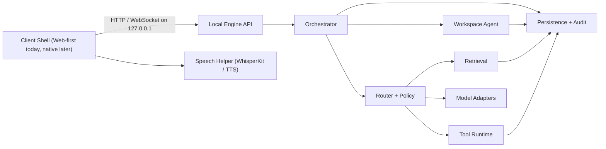
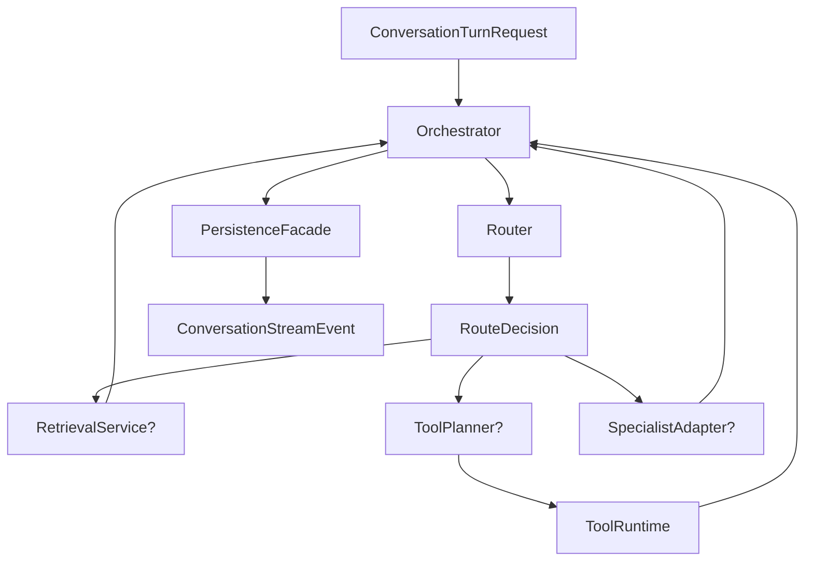

# Offline Field Assistant v1 Technical Architecture

Date: April 17, 2026
Status: Draft

Related docs:
- [Offline Field Assistant v1 Product Spec](offline-field-assistant-v1-product-spec.md)
- [Gemma Local Agent Architecture Brief](gemma-local-agent-architecture.md)
- [Gemma Local Expert Research Synthesis](gemma-local-expert-research-synthesis-2026-04-17.md)

## Purpose

This document converts the v1 product spec into an implementation architecture.

It defines:

- runtime topology
- recommended stack
- repo layout
- module ownership
- public contracts between layers
- key domain interfaces
- storage boundaries
- invariants the codebase must enforce

This is the build contract for v1.

## Architecture summary

V1 should be a local two-process system with one optional embedded helper:

1. `desktop shell`
2. `local engine`
3. `speech helper` inside the desktop shell when needed

This is not a microservice system.

The local engine is a modular monolith that owns:

- MLX inference
- routing
- retrieval
- ingestion
- tool execution
- persistence
- audit and approvals

The desktop shell owns:

- user experience
- mode switching
- local file pickers and camera input
- streaming display
- speech capture and playback surface

Current implementation note:

- the web chat shell is the primary tested demo surface today
- Apple shell code exists, but the web shell is the reference client for the
  current agent-run and approval UX

## Recommended implementation stack

### Desktop shell

Recommended:

- `SwiftUI` macOS app

Why:

- launch target is Apple Silicon Mac
- best fit for local app UX and OS integration
- easiest path to `WhisperKit`
- simpler local file, camera, microphone, and background task integration

Fallback:

- a web-based desktop shell is acceptable later, but the v1 architecture should assume a native macOS shell

### Local engine

Recommended:

- `Python 3.12`
- `FastAPI`
- `Pydantic`
- `asyncio`
- `sqlite3` or `SQLAlchemy` over SQLite

Why:

- MLX model tooling is strongest in Python
- `Docling` and related parsing tooling are Python-friendly
- engine contracts can be exposed cleanly with OpenAPI plus streaming

### Model runtime

- `mlx-lm` for text models
- `mlx-vlm` for multimodal models
- `mlx-embeddings` for embeddings

### Storage

- SQLite
- FTS5
- `sqlite-vec`
- local encrypted file workspace

## Runtime topology



## Process model

### Process 1: desktop shell

Responsibilities:

- render chat, notes, tasks, library, import flows
- stream assistant output
- gather user approvals
- own microphone and speaker surface
- launch and supervise the local engine

Non-responsibilities:

- no direct DB access
- no direct model inference except speech helper behavior owned by the app
- no routing logic

### Process 2: local engine

Responsibilities:

- expose the local typed API
- manage model lifecycles
- run orchestration and routing
- run bounded workspace-agent plans
- execute retrieval and ingestion jobs
- own all durable writes
- maintain audit and approval state

Non-responsibilities:

- no UI rendering concerns
- no direct OS microphone control

### Embedded helper: speech helper

Recommended placement:

- inside the desktop shell process

Responsibilities:

- local STT for user audio
- local TTS for assistant playback
- partial transcript streaming to UI

Why this stays in the app:

- better OS integration
- simpler permission handling
- simpler real-time UX

## Local communication contract

### Transport

Use:

- HTTP for request/response
- WebSocket for streaming assistant events

Bind only to:

- `127.0.0.1`

Require:

- ephemeral session token generated by the desktop shell when launching the engine

### Why not internal function calls

The engine process boundary is useful because it:

- isolates model crashes
- makes memory ownership clearer
- allows future replacement of the UI shell
- gives us a stable contract surface for tests and eval harnesses

## Monorepo structure

```text
apps/
  desktop-macos/
    App/
    Features/
    Speech/
    EngineClient/
contracts/
  openapi/
  events/
  exports/
docs/
engine/
  agent/
  api/
  orchestrator/
  routing/
  policy/
  retrieval/
  ingestion/
  tools/
  approvals/
  persistence/
  audit/
  models/
    gemma4/
    embeddinggemma/
    functiongemma/
    paligemma/
    medgemma/
    translategemma/
    speech/
  jobs/
  config/
data/
  migrations/
knowledge_packs/
evals/
  routing/
  retrieval/
  tool_calling/
  translation/
  ingestion/
  medical/
scripts/
```

## Repo ownership and contracts

### `apps/desktop-macos`

Owns:

- presentation state
- navigation
- user interaction
- speech UX
- engine lifecycle management

Must not:

- read SQLite directly
- compose prompts
- decide tool routing
- write artifacts except through engine API

### `engine/api`

Owns:

- public local API
- request validation
- streaming event serialization
- session token enforcement

Must not:

- contain routing heuristics
- contain business logic beyond translation between wire DTOs and app services

### `engine/orchestrator`

Owns:

- main conversation loop
- prompt assembly
- response synthesis
- conversation turn lifecycle

Must not:

- write to persistence directly
- call SQLite directly
- perform ad hoc tool execution

It may only use:

- router
- model gateway
- retrieval service
- tool runtime
- persistence facade

### `engine/routing`

Owns:

- capability selection
- retrieval decision
- tool route decision
- specialist model route decision
- mode gating

Must not:

- execute tools
- write records
- call UI code

### `engine/policy`

Owns:

- invariants
- approval rules
- medical gating
- export restrictions

Must be evaluated:

- before tool execution
- before permanent writes
- before medical specialist activation

### `engine/retrieval`

Owns:

- embedding generation
- lexical search
- vector search
- hybrid ranking
- chunk selection for prompting

Must not:

- build prompts
- interpret user intent beyond retrieval configuration inputs

### `engine/ingestion`

Owns:

- file normalization
- document parsing
- OCR and extraction prep
- chunk generation
- metadata extraction

Must output:

- normalized assets
- structured chunks
- indexing jobs

### `engine/tools`

Owns:

- typed tool registry
- tool execution
- tool result normalization
- side-effect boundaries

Must not:

- expose arbitrary shell or filesystem mutation tools in v1

### `engine/persistence`

Owns:

- all durable writes
- repository interfaces
- transactions
- migrations

This is the only layer allowed to write:

- conversations
- notes
- tasks
- approvals
- audit records
- document assets
- knowledge pack manifests

### `engine/audit`

Owns:

- append-only audit event creation
- medical provenance records
- approval histories

### `engine/models`

Owns:

- model loading
- inference adapters
- model-specific preprocessing and postprocessing

Must not:

- know about UI
- know about SQLite
- know about domain workflows outside the adapter request and response types

## Architectural invariants

These are hard rules.

1. General mode cannot invoke medical tools without an explicit medical session.
2. Only the persistence layer may perform durable writes.
3. The UI may not bypass the engine and mutate local state directly.
4. Retrieval returns chunks and scores, not finished prompts.
5. Tool execution must pass through policy checks.
6. Every export and every medical write must produce an audit record.
7. Engine API contracts must be versioned and backward compatible within a minor release line.

## Internal architecture

### Core engine flow



### Route precedence

The router must evaluate decisions in this order:

1. mode gate
2. safety and approval preconditions
3. retrieval need
4. tool need
5. specialist route need
6. fallback to general Gemma 4 response

This avoids premature specialist routing.

## Public engine API

### API shape

Version all routes under:

- `/v1`

### Core endpoints

#### `POST /v1/conversations`

Create a conversation.

Returns:

- `Conversation`

#### `POST /v1/conversations/{conversation_id}/turns`

Submit a user turn and receive a stream of engine events.

Transport:

- WebSocket or chunked event stream

Input:

- `ConversationTurnRequest`

Events:

- `turn.status`
- `assistant.delta`
- `assistant.message.completed`
- `citation.added`
- `tool.proposed`
- `tool.started`
- `tool.completed`
- `approval.required`
- `warning`
- `error`

For workspace-agent turns, stream payloads may also include:

- `run_id`
- `run_status`
- a structured `run` snapshot
- a structured `step` snapshot when relevant

#### `GET /v1/conversations/{conversation_id}/runs`

List durable workspace-agent runs attached to a conversation.

Returns:

- `list[AgentRun]`

#### `GET /v1/runs/{run_id}`

Read a single durable workspace-agent run.

Returns:

- `AgentRun`

#### `GET /v1/system/capabilities`

Return truthful runtime capability state for the current local environment.

Returns:

- `SystemCapabilities`

#### `POST /v1/knowledge-packs/import`

Import a local knowledge pack.

Input:

- `KnowledgePackImportRequest`

Returns:

- `KnowledgePackImportResult`

#### `POST /v1/ingest/assets`

Ingest document or image assets.

Input:

- `AssetIngestRequest`

Returns:

- `AssetIngestResult`

#### `POST /v1/library/search`

Run structured retrieval without a conversation.

Input:

- `LibrarySearchRequest`

Returns:

- `LibrarySearchResult`

#### `POST /v1/translate`

Translate text or image text.

Input:

- `TranslationRequest`

Returns:

- `TranslationResult`

#### `POST /v1/approvals/{approval_id}/decisions`

Approve or reject a pending action.

Input:

- `ApprovalDecision`

Returns:

- `ApprovalState`

#### `POST /v1/medical/sessions`

Open an explicit medical session.

Returns:

- `MedicalSession`

#### `POST /v1/exports`

Export report, brief, or transcript artifact.

Input:

- `ExportRequest`

Returns:

- `ExportResult`

## Wire contracts

These are the canonical DTOs. Use Pydantic in the engine and export the OpenAPI snapshot into `contracts/openapi/`.

### `ConversationTurnRequest`

```json
{
  "conversation_id": "conv_123",
  "mode": "general",
  "text": "Summarize the forms I imported today",
  "asset_ids": ["asset_1", "asset_2"],
  "enabled_knowledge_pack_ids": ["pack_ops", "pack_trip_kenya"],
  "response_preferences": {
    "style": "concise",
    "citations": true,
    "audio_reply": false
  }
}
```

### `ConversationStreamEvent`

```json
{
  "type": "citation.added",
  "conversation_id": "conv_123",
  "turn_id": "turn_456",
  "payload": {
    "citation_id": "cit_1",
    "asset_id": "asset_9",
    "chunk_id": "chunk_44",
    "label": "Kenya trip checklist",
    "score": 0.88
  }
}
```

### `AgentRun`

```json
{
  "id": "run_123",
  "conversation_id": "conv_123",
  "turn_id": "turn_456",
  "goal": "Prepare a briefing from the relevant workspace files.",
  "scope_root": "/workspace/docs",
  "status": "awaiting_approval",
  "plan_steps": [],
  "executed_steps": [],
  "result_summary": "Awaiting approval to run `create_note` from workspace findings.",
  "artifact_ids": [],
  "approval_id": "approval_123"
}
```

### `SystemCapabilities`

```json
{
  "assistant_backend": "mock",
  "assistant_model": "gemma-4-e4b-it",
  "embedding_backend": "hash",
  "embedding_model": "embeddinggemma-300m",
  "specialist_backend": "ocr",
  "vision_model": "paligemma-2",
  "tracking_backend": "ffmpeg",
  "tracking_model": "sam3.1",
  "medical_model": "medgemma-1.5-4b",
  "workspace_root": "/workspace",
  "tesseract_available": true,
  "ffmpeg_available": true,
  "assistant_model_available": false,
  "embedding_model_available": false,
  "vision_model_available": false,
  "tracking_model_available": false,
  "medical_model_available": false,
  "low_memory_profile": true
}
```

### `RouteDecision`

```json
{
  "mode": "general",
  "needs_retrieval": true,
  "needs_tools": false,
  "specialist_route": null,
  "retrieval_plan": {
    "query": "forms imported today summary",
    "pack_scope": ["pack_ops"],
    "top_k": 8
  },
  "approval_level": "none"
}
```

### `ToolCallProposal`

```json
{
  "tool_name": "create_task",
  "arguments": {
    "title": "Review extracted intake forms",
    "due_date": "2026-04-18"
  },
  "requires_confirmation": true
}
```

### `ApprovalRequest`

```json
{
  "approval_id": "apr_123",
  "scope": "write_task",
  "reason": "Creating a permanent task record",
  "proposed_action": {
    "tool_name": "create_task",
    "arguments": {
      "title": "Review extracted intake forms"
    }
  }
}
```

### `KnowledgePackManifest`

```json
{
  "pack_id": "pack_trip_kenya",
  "name": "Kenya Mission Trip Pack",
  "version": "1.0.0",
  "locale_tags": ["en", "sw"],
  "asset_count": 42,
  "default_enabled": false
}
```

## Internal service interfaces

Use these as the core Python interfaces.

### Model gateway

```python
class ChatModel(Protocol):
    async def stream(self, request: "ChatRequest") -> AsyncIterator["ChatDelta"]: ...


class EmbeddingModel(Protocol):
    async def embed(self, texts: list[str]) -> list[list[float]]: ...


class VisionModel(Protocol):
    async def analyze(self, request: "VisionRequest") -> "VisionResult": ...


class TranslationModel(Protocol):
    async def translate(self, request: "TranslationRequest") -> "TranslationResult": ...


class SpeechToTextProvider(Protocol):
    async def transcribe(self, request: "TranscriptionRequest") -> "TranscriptionResult": ...
```

### Retrieval service

```python
class RetrievalService(Protocol):
    async def search(self, request: "RetrievalRequest") -> list["RetrievedChunk"]: ...
    async def index_assets(self, asset_ids: list[str]) -> None: ...
```

### Tool runtime

```python
class ToolRuntime(Protocol):
    async def propose(self, request: "ToolPlanningRequest") -> list["ToolCallProposal"]: ...
    async def execute(self, proposal: "ApprovedToolCall") -> "ToolExecutionResult": ...
```

### Persistence facade

```python
class PersistenceFacade(Protocol):
    async def create_conversation(self, request: "CreateConversationRequest") -> "Conversation": ...
    async def append_turn(self, record: "ConversationTurnRecord") -> None: ...
    async def save_note(self, request: "SaveNoteRequest") -> "NoteRecord": ...
    async def save_task(self, request: "SaveTaskRequest") -> "TaskRecord": ...
    async def append_audit_event(self, event: "AuditEvent") -> None: ...
```

## Domain data models

These are the core persisted concepts.

### Conversation

- `conversation_id`
- `mode`
- `title`
- `created_at`
- `updated_at`
- `enabled_knowledge_pack_ids`

### Turn

- `turn_id`
- `conversation_id`
- `role`
- `text`
- `asset_ids`
- `model_route`
- `created_at`

### Asset

- `asset_id`
- `asset_type` (`pdf`, `image`, `audio`, `doc`, `note`)
- `path`
- `sha256`
- `metadata_json`
- `ingest_status`

### Chunk

- `chunk_id`
- `asset_id`
- `text`
- `page_number`
- `bbox_json`
- `embedding_ref`

### Note

- `note_id`
- `title`
- `body_markdown`
- `source_asset_ids`
- `created_at`
- `updated_at`

### Task

- `task_id`
- `title`
- `status`
- `due_date`
- `linked_note_id`
- `created_at`

### Approval

- `approval_id`
- `scope`
- `status`
- `requested_at`
- `decided_at`
- `decision_json`

### Audit event

- `audit_event_id`
- `event_type`
- `scope`
- `actor`
- `conversation_id`
- `medical_session_id`
- `payload_json`
- `created_at`

## SQLite schema boundaries

Recommended table groups:

- `conversations`
- `turns`
- `assets`
- `chunks`
- `notes`
- `tasks`
- `knowledge_packs`
- `knowledge_pack_assets`
- `approvals`
- `audit_events`
- `exports`

Recommended search tables:

- `chunks_fts`
- `notes_fts`
- `chunk_embeddings`

Contract rule:

- only repositories in `engine/persistence` may issue write SQL

## Prompt composition contract

Prompt composition belongs only in `engine/orchestrator`.

Inputs:

- user turn
- route decision
- retrieved chunks
- tool results
- mode context

Outputs:

- `ChatRequest` for the selected model

Prompt builders must be:

- deterministic with logged inputs
- mode-aware
- specialist-aware

No other module should concatenate retrieval results into prompts.

## Tool contract rules

Every tool in v1 must define:

- stable tool name
- typed argument schema
- side-effect classification
- approval requirement
- audit requirement

Canonical side-effect classes:

- `read_only`
- `draft_only`
- `durable_write`
- `medical_write`
- `export`

Example:

```python
@dataclass
class ToolDefinition:
    name: str
    input_schema: dict
    side_effect: Literal["read_only", "draft_only", "durable_write", "medical_write", "export"]
    requires_confirmation: bool
    requires_audit: bool
```

## Medical mode architecture

Medical mode is a separate workflow context, not a prompt flag.

Requirements:

- explicit `medical_session_id`
- explicit mode badge in UI
- separate policy enforcement path
- separate audit events
- specialist routing only inside medical mode

The general orchestrator may still own conversation flow, but medical tools and medical model routes are unavailable unless:

- the conversation is in medical mode
- the policy layer validates the request

## Job system

Use an in-process async job queue inside the local engine for non-interactive work:

- ingestion
- embedding generation
- re-indexing
- export generation

Do not create a separate worker service in v1.

Each job must have:

- `job_id`
- `job_type`
- `status`
- `progress`
- `result_ref`
- `error`

## Streaming protocol

Assistant turn streaming should be event-based.

Required event types:

- `turn.status`
- `assistant.delta`
- `assistant.message.completed`
- `citation.added`
- `tool.proposed`
- `tool.started`
- `tool.completed`
- `approval.required`
- `job.progress`
- `warning`
- `error`

UI contract:

- UI renders only from stream events and final read models
- UI does not infer hidden state transitions that the engine did not emit

## Security model

### Local API security

- bind to loopback only
- require ephemeral bearer token from app launcher
- reject requests with missing or stale token

### Filesystem security

- all imports copied or linked into app-owned workspace
- no arbitrary path traversal
- no shell tools in v1

### Data safety

- all durable writes audited when side effects matter
- medical actions always audited

## Failure and fallback behavior

### Model unavailable

- engine emits `warning`
- router falls back to allowed default path
- UI shows downgraded capability notice

### Retrieval failure

- assistant can still answer, but must mark that local retrieval failed when citations were expected

### Tool rejection

- tool not executed
- stream emits `approval.required` or `warning`

### Medical specialist unavailable

- general chat must not silently answer as if the medical specialist ran
- UI must show medical module unavailable

## Evaluation hooks

Every core module needs an eval surface.

### Routing evals

- specialist vs general route accuracy
- false medical route rate
- missed retrieval rate

### Retrieval evals

- citation relevance
- pack filtering correctness
- lexical plus semantic hybrid performance

### Tool evals

- schema-valid proposal rate
- approval correctness
- mutation correctness

### Translation evals

- task success by language pair
- image text translation correctness

### Medical evals

- mode isolation
- audit completeness
- refusal and review-language correctness

## Implementation sequence

Build in this order:

1. `contracts/` and public API DTOs
2. `engine/api` and engine bootstrap
3. `engine/persistence`
4. `engine/models/gemma4`
5. `engine/orchestrator`
6. `engine/retrieval`
7. `apps/desktop-macos`
8. `engine/tools`
9. `engine/ingestion`
10. translation and vision specialists
11. medical mode beta

## First scaffold targets

The first scaffold should create:

- `apps/desktop-macos`
- `engine/api`
- `engine/orchestrator`
- `engine/persistence`
- `engine/models/gemma4`
- `engine/retrieval`
- `contracts/openapi`

That is enough to stand up:

- local app launch
- chat loop
- SQLite persistence
- retrieval-backed conversation

Everything else can layer onto that.
